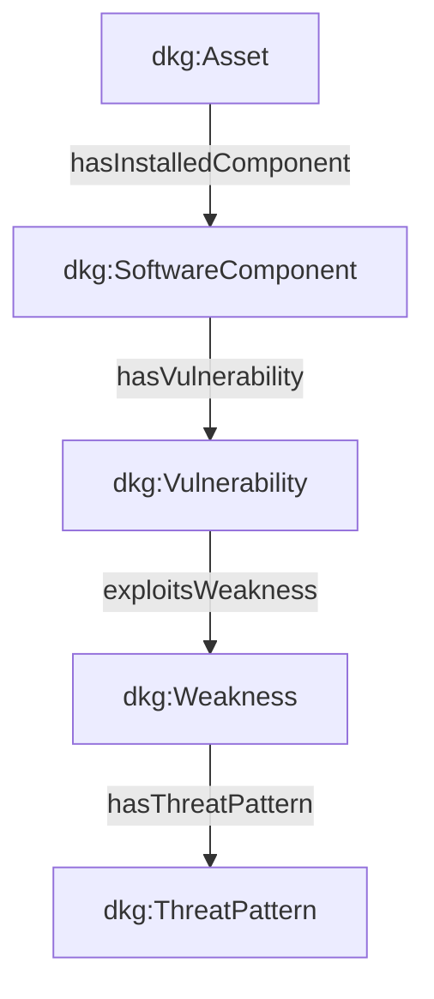

# 📜 Instanciation ABox Cyber & Référentiels CTI

## 📖 1. Résumé Exécutif & Glossaire

### 1.1 Objectif
La présente spécification encadre la réalisation du **Jeu de Données Factuelles de Synthèse (ABox)** pour le UseCase Cybersécurité (Phase 2).  
Elle définit le namespace, la convention de nommage des URIs, la population de la cartographie du SI et l'intégration des référentiels publics de menaces (CVE, CWE, CAPEC).

### 1.2 Glossaire Métier & Technique
| Acronyme / Concept | Définition | Contexte DKG |
| :--- | :--- | :--- |
| **DKG** | Dynamic Knowledge Graph | Graphe de connaissances dynamique. |
| **ABox** | Assertional Box | Données factuelles et instances du graphe. |
| **CVE** | Common Vulnerabilities and Exposures | Référentiel des vulnérabilités. |
| **CWE** | Common Weakness Enumeration | Référentiel des faiblesses logicielles. |
| **CAPEC** | Common Attack Pattern Enumeration | Modes opératoires d'attaque. |
| **CVSS** | Common Vulnerability Scoring System | Score de sévérité (0.0 à 10.0). |

## 🏗️ 2. Périmètre & Rôle de la Spécification

- **Positionnement dans l'Architecture** : Document de niveau **Niveau 3 — Cas d'Usage Technique**. Il régit la génération de la cartographie SI et des données CTI d'injection dans `DKG_ABox_Master.ttl`.
- **Gouvernance & Validation** : Validé par l'équipe DevSecOps. Il spécifie la structure du générateur Python `generate_phase2_abox.py`.



## 📐 3. Spécifications Formelles & Rules Métier

### 3.1 Espaces de Noms & Nommage des Instances

- **Namespace Référentiel Données [`EXG-CT-01`]** : L'espace de noms d'instanciation du UseCase Cyber est strictly fixe à `http://dkg.cybersec.org/data/` (Préfixe : `dkg-data:`).
    
- **URIs Déterministes & Normalisées [`EXG-CT-02`]** : Les URIs d'instances doivent employer des identifiants stables et prévisibles (ex: `dkg-data:Asset-Srv-Prod-01`, `dkg-data:CVE-2021-41773`, `dkg-data:CWE-22`, `dkg-data:CAPEC-126`).
    

### 3.2 Structure du Jeu de Données de Synthèse Cyber

- **Complétude du Graphe Cyber [`EXG-CT-03`]** : Le jeu d'instances de synthèse doit obligatoirement inclure et relier la chaîne complète des entités métiers Cybersécurité :
    
    - **Actifs du SI** (`dkg:Asset`)
        
    - **Composants Logiques** (`dkg:SoftwareComponent`)
        
    - **Vulnérabilités NIST** (`dkg:Vulnerability`)
        
    - **Faiblesses Logicielles** (`dkg:Weakness`)
        
    - **Modes Opératoires Attack** (`dkg:ThreatPattern`)
        
    - **Marquage TLP** (`dkg:TLPMarking`)

```
@prefix dkg: [http://dkg.cybersec.org/tbox#](http://dkg.cybersec.org/tbox#) .
@prefix dkg-data: [http://dkg.cybersec.org/data/](http://dkg.cybersec.org/data/) .
@prefix rdfs: [http://www.w3.org/2000/01/rdf-schema#](http://www.w3.org/2000/01/rdf-schema#) .
@prefix xsd: [http://www.w3.org/2001/XMLSchema#](http://www.w3.org/2001/XMLSchema#) .

dkg-data:Asset-Srv-Prod-01 a dkg:Asset ;
    rdfs:label "Serveur Web de Production"@fr ;
    dkg:hasInstalledComponent dkg-data:Comp-Apache-2-4 ;
    dkg:hasTLPMarking dkg-data:TLP-AMBER .

dkg-data:Comp-Apache-2-4 a dkg:SoftwareComponent ;
    rdfs:label "Apache HTTP Server 2.4.41"@fr ;
    dkg:hasVulnerability dkg-data:CVE-2021-41773 .

dkg-data:CVE-2021-41773 a dkg:Vulnerability ;
    dkg:cvssScore "7.5"^^xsd:decimal ;
    dkg:exploitsWeakness dkg-data:CWE-22 .

dkg-data:CWE-22 a dkg:Weakness ;
    rdfs:label "Path Traversal"@en ;
    dkg:hasThreatPattern dkg-data:CAPEC-126 .
```


### 3.3 Contrôles Qualité et Intégrité Données

- **Validation SHACL & Plages CVSS [`EXG-QU-02`]** : Toutes les instances du UseCase doivent satisfaire aux contraintes typiques de datatypes (`xsd:decimal` entre `0.0` et `10.0` pour les CVSS) et de cardinalités minimums sous CWA.
    
- **Intégrité de Recette [`EXG-QU-03`]** : Le fichier généré doit valider le Sanity Check sans aucune erreur `sh:Violation`.
    

## 📊 4. Matrice d'Exigences & Critères d'Acceptation (EXG-)

|**Identifiant**|**Domaine**|**Intitulé de l'Exigence**|**Description & Critères d'Acceptation**|**Mode de Test / Asset**|
|---|---|---|---|---|
|**EXG-CT-01**|`CT`|Namespace Instance Dedicated|Utilisation exclusive de `http://dkg.cybersec.org/data/`.|Parsing RDF / Code|
|**EXG-CT-02**|`CT`|Identifiants URIs Déterministes|Format de nommage normé pour Actifs, CVE, CWE, CAPEC.|Linter / Regex|
|**EXG-CT-03**|`CT`|Instanciation Graphe Complète|Population de la chaîne complète Asset -> CVE -> CWE -> CAPEC.|Requête SPARQL|
|**EXG-QU-02**|`QU`|Typage & Plages CVSS|Strict respect du format CVSS decimal [0.0, 10.0] sous CWA.|pySHACL CWA|
|**EXG-QU-03**|`QU`|Sanity Check ABox Zero Error|0 erreur de validation sous CWA lors du contrôle Pytest.|Pytest / SHACL|

## 🛡️ 5. Outillage, CI/CD & Traçabilité Pytest

- **Scripts de Génération / Exécution** : `03-Application/generate_phase2_abox.py`
    
- **Suites de Tests Associées** : `tests/test_phase2_abox.py`
    
- **Artefacts Produits** : `02-Donnees/Master_Transversal/DKG_ABox_Master.ttl`
    

## 📚 6. Documents Liés & Références

- **[SPC-FWK-P1-GOUVERNANCE_01]** : Gouvernance du Cadre Spécifications & Exigences DKG.
    
- **[SPC-FWK-P2-ABOX_01]** : Spécification des Contraintes & Règles de Validation ABox.
    
- **[NVD NIST]** : https://nvd.nist.gov/
    
- **[MITRE CWE / CAPEC]** : https://cwe.mitre.org/