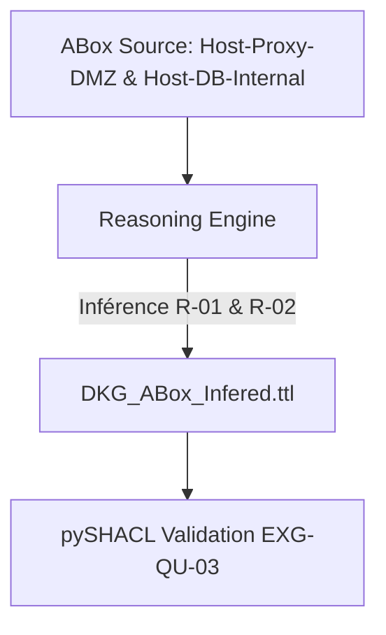

# 📜 Raisonnement & Propagation Silent Cascade

## 📖 1. Résumé Exécutif & Glossaire

### 1.1 Objectif
Spécifier le jeu de données de validation ABox et le harnais d'exécution Pytest pour le moteur de raisonnement sur le cas d'usage *Silent Cascade*.

### 1.2 Glossaire Métier & Technique
| Acronyme / Concept | Définition | Contexte DKG |
| :--- | :--- | :--- |
| **ABox Inferred** | Graphe de Faits Déduits | Stockage dédié (`DKG_ABox_Infered.ttl`) recevant les résultats d'inférence. |
| **Pivot Asset** | Actif Intermédiaire | Serveur DMZ intermédiaire exposé servant de point de rebond. |

## 🏗️ 2. Périmètre & Rôle de la Spécification

- **Positionnement dans l'Architecture** : Document de niveau **Niveau 3 — Cas d'Usage Technique**. Encadre l'exécution technique du raisonnement de Phase 5.
- **Gouvernance & Validation** : Validé par le Lead DevSecOps et l'Architecte Ontologue.



## 📐 3. Spécifications Formelles & Triplets RDF

### 3.1 Graphe d'Entrée & Instanciation ABox Source (`TLP:RED` / `TLP:CLEAR`)

Extrait de code

```turtle
@prefix dkg: [http://dkg.cybersec.org/tbox#](http://dkg.cybersec.org/tbox#) .
@prefix dkg-data: [http://dkg.cybersec.org/data#](http://dkg.cybersec.org/data#) .
@prefix dkg-cti: [http://dkg.cybersec.org/cti#](http://dkg.cybersec.org/cti#) .
@prefix rdfs: [http://www.w3.org/2000/01/rdf-schema#](http://www.w3.org/2000/01/rdf-schema#) .
@prefix xsd: [http://www.w3.org/2001/XMLSchema#](http://www.w3.org/2001/XMLSchema#) .

# Données d'infrastructure (ABox Interne TLP:RED)
dkg-data:Host-Proxy-DMZ a dkg:Host ;
    rdfs:label "Proxy DMZ Principal" ;
    dkg:isExposedToInternet "true"^^xsd:boolean ;
    dkg:hasVulnerability dkg-cti:CVE-2024-SILENT ;
    dkg:connectsTo dkg-data:Host-DB-Internal .

dkg-data:Host-DB-Internal a dkg:Host ;
    rdfs:label "Base de Données RH Core" ;
    dkg:criticalityLevel "CRITICAL" .

# Données CTI (ABox CTI TLP:CLEAR)
dkg-cti:CVE-2024-SILENT a dkg:Vulnerability ;
    dkg:cvssScore "9.8"^^xsd:float ;
    dkg:isCisaKev "true"^^xsd:boolean .
```

### 3.2 Triplet Attendu en Sortie du Raisonneur (`DKG_ABox_Infered.ttl`) [`EXG-IN-01`, `EXG-IN-02`]

Le moteur d'inférence doit générer de façon exacte et déterministe le bloc Turtle suivant :

Extrait de code

```turtle
@prefix dkg: [http://dkg.cybersec.org/tbox#](http://dkg.cybersec.org/tbox#) .
@prefix dkg-data: [http://dkg.cybersec.org/data#](http://dkg.cybersec.org/data#) .

# Inférence 1 : Qualification du risque hôte (EXG-IN-01)
dkg-data:Host-Proxy-DMZ a dkg:HighRiskAsset ;
    dkg:hasRiskReason "Exposed vulnerability listed in CISA KEV" .

# Inférence 2 : Matérialisation de la trajectoire d'attaque (EXG-IN-02)
dkg-data:Host-Proxy-DMZ dkg:exposesToCascade dkg-data:Host-DB-Internal .
```

## 📊 4. Matrice d'Exigences & Critères d'Acceptation (EXG-)

| **Identifiant** | **Domaine** | **Intitulé de l'Exigence**      | **Description & Critères d'Acceptation**                                                                                  | **Mode de Test / Asset**   |
| --------------- | ----------- | ------------------------------- | ------------------------------------------------------------------------------------------------------------------------- | -------------------------- |
| **EXG-IN-01**   | `IN`        | Inférence Hôte Pivot            | Assertion Pytest vérifiée : `dkg-data:Host-Proxy-DMZ a dkg:HighRiskAsset`.                                                | `test_phase5_inference.py` |
| **EXG-IN-02**   | `IN`        | Inférence Cascade               | Assertion Pytest vérifiée : présence du triplet `dkg-data:Host-Proxy-DMZ dkg:exposesToCascade dkg-data:Host-DB-Internal`. | `test_phase5_inference.py` |
| **EXG-QU-03**   | `QU`        | Validation SHACL Post-Inférence | Le graphe fusionné (Base + Inferred) doit produire zéro violation SHACL (`sh:Violation`).                                 | pySHACL                    |

## 🛡️ 5. Outillage, CI/CD & Traçabilité Pytest

- **Scripts de Génération / Exécution** : `03-Application/Phase5/reasoning_engine.py`
    
- **Suites de Tests Associées** : `03-Application/Tests/test_phase5_inference.py`
    
- **Artefacts Produits** : `02-Donnees/Snapshots_Phases/Phase5/DKG_ABox_Infered.ttl`
    

## 📚 6. Documents Liés & Références

- **[SPC-FWK-P1-GOUVERNANCE_01]** : Gouvernance du Cadre Spécifications & Exigences DKG.
    
- **[SPC-FWK-P5-RULES_01]** : Reasoning Rules & RBox Inference.
    
- **[SPC-MET-P3-SILENT_01]** : Scénario d'Attaque Silent Cascade.