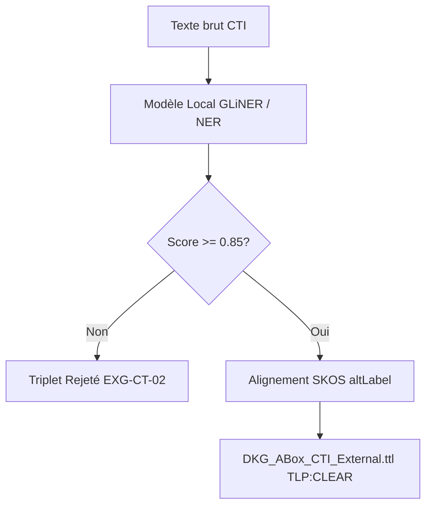

# 📜 Ingestion CTI, Pipeline NER & Normalisation

## 📖 1. Résumé Exécutif & Glossaire

### 1.1 Objectif
Spécifier l'architecture du pipeline NER (*Named Entity Recognition*) pour l'extraction d'entités cyber à partir de flux CTI non structurés (bulletins PDF, blogs), la résolution d'ambiguïtés via le dictionnaire d'acronymes TBox, et la génération de triplets RDF qualifiés.

### 1.2 Glossaire Métier & Technique
| Acronyme / Concept | Définition | Contexte DKG |
| :--- | :--- | :--- |
| **NER** | Named Entity Recognition | Reconnaissance d'entités cyber dans le texte brut. |
| **Confidence Score** | Score de Confiance NLP | Indice de certitude (0.0 à 1.0) sur les entités/relations extraites. |
| **Entity Disambiguation** | Normalisation d'Entité | Alignement d'un terme extrait (*"Cozy Bear"*) vers l'URI TBox (`dkg-cti:ThreatActor-APT29`) via `skos:altLabel`. |

## 🏗️ 2. Périmètre & Rôle de la Spécification

- **Positionnement dans l'Architecture** : Document de niveau **Niveau 3 — Cas d'Usage Technique**.
- **Gouvernance & Validation** : Validé par le Lead MLOps et l'Architecte Sémantique.



## 📐 3. Spécifications Formelles & Triplets RDF Extraits

### 3.1 Pipeline NER & Normalisation SKOS [`EXG-CT-01`]

Le modèle NLP extrait les mentions textuelles et consulte le socle SKOS pour résoudre les acronymes et noms alternatifs vers l'URI canonique.

Extrait de code

```turtle
# Exemple d'extraction et normalisation de texte brut (TLP:CLEAR)
@prefix dkg: [http://dkg.cybersec.org/tbox#](http://dkg.cybersec.org/tbox#) .
@prefix dkg-cti: [http://dkg.cybersec.org/cti#](http://dkg.cybersec.org/cti#) .
@prefix rdfs: [http://www.w3.org/2000/01/rdf-schema#](http://www.w3.org/2000/01/rdf-schema#) .
@prefix xsd: [http://www.w3.org/2001/XMLSchema#](http://www.w3.org/2001/XMLSchema#) .

dkg-cti:ThreatActor-APT29 a dkg:ThreatActor ;
    rdfs:label "APT29 (Cozy Bear)" ;
    dkg:nerConfidenceScore "0.94"^^xsd:float ;
    dkg:hasThreatPattern dkg-cti:Pattern-Spearphishing .

dkg-cti:Pattern-Spearphishing a dkg:ThreatPattern ;
    rdfs:label "Spearphishing Link" ;
    dkg:nerConfidenceScore "0.89"^^xsd:float .
```

### 3.2 Seuil de Confiance & Contraintes Localisation [`EXG-CT-02`, `EXG-SE-03`]

Tout triplet issu du NER ne peut être injecté que si `dkg:nerConfidenceScore` $\ge 0.85$. L'exécution s'effectue strictement hors-ligne via des modèles locaux pré-téléchargés.

## 📊 4. Matrice d'Exigences & Critères d'Acceptation (EXG-)

|**Identifiant**|**Domaine**|**Intitulé de l'Exigence**|**Description & Critères d'Acceptation**|**Mode de Test / Asset**|
|---|---|---|---|---|
|**EXG-CT-01**|`CT`|Extraction & Normalisation|Résolution à 100% des entités extraites vers la TBox Master à l'aide des labels `skos:altLabel`.|Pytest / AST|
|**EXG-CT-02**|`CT`|Seuil de Confiance NLP|Rejet systématique de tout triplet dont le score de confiance NLP est $< 0.85$.|Pytest (`test_phase5_ner.py`)|
|**EXG-QU-01**|`QU`|Validation SHACL NER|0 violation SHACL lors de l'injection des entités issues du NER dans l'ABox CTI.|pySHACL|
|**EXG-SE-03**|`SE`|NLP Air-Gapped|Le modèle NER doit s'exécuter localement sans aucun appel API externe.|Check Réseau / Local Cache|

## 🛡️ 5. Outillage, CI/CD & Traçabilité Pytest

- **Scripts de Génération / Exécution** : `03-Application/Phase5/ner_cti_extractor.py`
    
- **Suites de Tests Associées** : `03-Application/Tests/test_phase5_ner_validation.py`
    
- **Artefacts Produits** : `02-Donnees/Master_Transversal/DKG_ABox_CTI_External.ttl`
    

## 📚 6. Documents Liés & Références

- **[SPC-FWK-P1-GOUVERNANCE_01]** : Gouvernance du Cadre Spécifications & Exigences DKG.
    
- **[SPC-FWK-P5-RULES_01]** : Reasoning Rules & RBox Inference.
    
- **[SPC-TEC-P5-CONSO_01]** : Agent MITM & Consolidation SKOS.