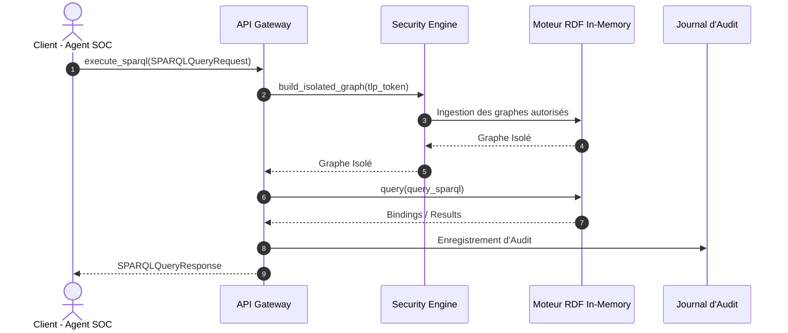

# 📜 API Gateway TLP & Immutabilité SPARQL

## 📖 1. Résumé Exécutif & Glossaire

### 1.1 Objectif
Spécifier l'implémentation logicielle du point d'entrée unique (API Gateway) assurant le traitement sécurisé, filtré et immutable des requêtes SPARQL sur le Knowledge Graph.

### 1.2 Glossaire Métier & Technique
| Acronyme / Concept | Définition | Contexte DKG |
| :--- | :--- | :--- |
| **API** | Application Programming Interface | Interface d'exposition SPARQL / GraphQL. |
| **Pydantic V2** | Modélisation et validation de données | Validation d'immutabilité avec `frozen=True`. |
| **SPARQL** | SPARQL Protocol and RDF Query Language | Langage d'interrogation des graphes RDF. |

## 🏗️ 2. Périmètre & Architecture Technique

- **Positionnement dans l'Architecture** : Document de niveau **Niveau 3 — Cas d'Usage Technique**.
- **Gouvernance & Validation** : Validé par le Lead DevSecOps et l'Architecte Logiciel.



## 📐 3. Spécifications Formelles & Contrats Pydantic

### 3.1 Contrats de Données Pydantic V2 (Immutabilité) [`EXG-TE-01`]

Python

```python
from enum import Enum
from typing import Optional, Dict, Any, List
from pydantic import BaseModel, Field, ConfigDict

class TLPLevel(str, Enum):
    CLEAR = "CLEAR"
    AMBER = "AMBER"
    RED = "RED"

class SPARQLQueryRequest(BaseModel):
    model_config = ConfigDict(frozen=True)
    client_id: str = Field(..., min_length=3)
    tlp_token: TLPLevel = Field(...)
    query: str = Field(..., min_length=10)

class SPARQLQueryResponse(BaseModel):
    model_config = ConfigDict(frozen=True)
    success: bool
    client_id: str
    tlp_applied: TLPLevel
    results_count: int
    bindings: List[Dict[str, Any]]
    error_message: Optional[str] = None
```

### 3.2 Directives d'Implémentation & Horodatage [`EXG-TE-02`]

- **Point d'entrée de traitement** : `03-Application/Phase6/api_gateway.py`
    
- **Pipeline d'orchestration** : `03-Application/Phase6/generate_phase6_gateway.py`
    
- **Horodatage UTC** : Imposé via `datetime.now(timezone.utc)` compatible Python 3.14+.
    

## 📊 4. Matrice d'Exigences & Critères d'Acceptation (EXG-)

|**Identifiant**|**Domaine**|**Intitulé de l'Exigence**|**Description & Critères d'Acceptation**|**Mode de Test / Asset**|
|---|---|---|---|---|
|**EXG-TE-01**|`TE`|Immutabilité Payloads|Modification interdite sur l'objet instancié (`frozen=True`).|PyTest (`test_pydantic_immutability`)|
|**EXG-TE-02**|`TE`|Standard Horodatage UTC|Utilisation de `timezone.utc` compatible Python 3.14+.|PyTest / Audit Log|

## 🛡️ 5. Outillage, CI/CD & Traçabilité Pytest

- **Scripts de Génération / Exécution** : `03-Application/Phase6/generate_phase6_gateway.py`
    
- **Suites de Tests Associées** : `03-Application/Test/test_phase6_gateway.py`
    
- **Artefacts Produits** : `02-Donnees/Snapshots_Phases/Phase6_API_Gateway/api_gateway_audit.log`
    

## 📚 6. Documents Liés & Références

- **[SPC-FWK-P1-GOUVERNANCE_01]** : Gouvernance du Cadre Spécifications & Exigences DKG.
    
- **[SPC-FWK-P6-HABILITATION_01]** : Spécification cadre des règles d'habilitation TLP.