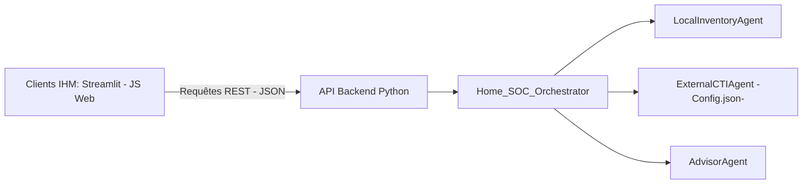

# 📜 Architecture des Micro-Agents, API Agnostique & Sécurisation des Données 
## 📖 1. Résumé Exécutif & Glossaire ### 1.1 Objectif Formaliser l'implémentation logicielle des micro-agents de la Phase 7 en garantissant : 
1. **L'indépendance technologique (Découplage IHM / Backend)** : Le moteur fonctionne de manière autonome via une API REST ou des modules Python purs, acceptant n'importe quel front-end (Streamlit, React, JS natif). 
2. **La robustesse de la lecture des propriétés** : Sécurisation totale face aux erreurs de parsing (clés absentes, types incorrects, dictionnaires mal formés). 

### 1.2 Glossaire Technique
| Acronyme / Concept | Définition | Contexte DKG | 
| :--- | :--- | :--- |
| **Parser Défensif** | Logique de lecture sécurisée avec valeurs par défaut et gestion d'exceptions. | Empêche les plantages sur données tierces incomplètes. |
| **Pydantic V2 `frozen=True`** | Immuabilité garantie des objets de télémétrie en mémoire[cite: 6]. | Intégrité des états ABox. | 

## 🏗️ 2. Architecture & Découplage Framework 



## 📐 3. Spécifications Formelles & Sécurisation Code

### 3.1 Exigences de Robustesse sur la Lecture des Propriétés

Pour éviter les échecs de lecture de propriétés (constatés lors des phases précédentes), tout script d'ingestion (JSON d'actifs ou flux CTI) doit appliquer le patron de conception **Parser Défensif** :

- Interdiction d'accéder directement à une clé d'un dictionnaire par `data["cle"]`.
    
- Utilisation systématique de la méthode sécurisée `data.get("cle", "valeur_par_defaut")`.
    
- Validation par modèle Pydantic V2 avec des champs optionnels (`Optional[...]`) ou des valeurs par défaut explicites.
    

### 3.2 Exemple de Schéma d'Entrée Externe (`external_sources_config.json`)

Stocké dans `02-Donnees/Input_Phases/` pour piloter les connecteurs réseau de l'agent CTI sans modifier le code source :


```json
{
  "sources": [
    {
      "source_id": "cisa_kev",
      "name": "CISA Known Exploited Vulnerabilities",
      "type": "Structured",
      "endpoint_url": "[https://www.cisa.gov/sites/default/files/feeds/known_exploited_vulnerabilities.json](https://www.cisa.gov/sites/default/files/feeds/known_exploited_vulnerabilities.json)",
      "timeout_seconds": 10,
      "enabled": true
    }
  ]
}
```

## 📊 4. Matrice d'Exigences Techniques (EXG-)

|**Identifiant**|**Domaine**|**Intitulé de l'Exigence**|**Description & Critères d'Acceptation**|**Mode de Test / Asset**|
|---|---|---|---|---|
|**EXG-P7-04**|`TEC`|Immuabilité & Parsers Défensifs|Classes Pydantic V2 `frozen=True` et gestion anti-crash des clés JSON[cite: 6].|PyTest unitaire|
|**EXG-P7-05**|`TEC`|Isolation TLP & Config Externe|Respect de la ségrégation et lecture dynamique des sources via JSON[cite: 6].|Audit de code & Logs|
|**EXG-P7-06**|`TEC`|Contrat d'API Agnostique|Exposition des services par routes JSON pour découplage d'IHM.|Tests de contrat API|

## 🛡️ 5. Outillage & Traçabilité Pytest

- **Scripts d'Implémentation :** `03-Application/micro_agents_runner.py` et `03-Application/api_backend.py`
    
- **Suite de Test Associée :** `tests/test_p7_micro_agents_robustness.py`
    
- **Artefacts Produits :** `02-Donnees/Snapshots_Phases/Phase7_Residential_Box/DKG_ABox_Residential.ttl`