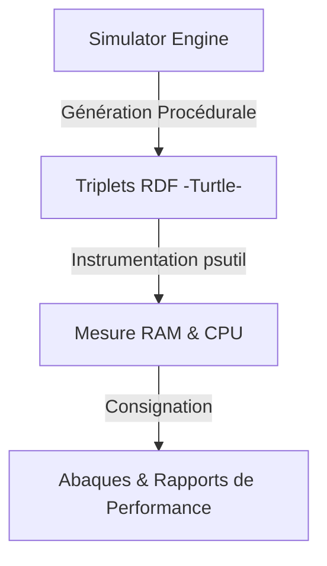

# 📜 Simulateur Frugal & Abaques de Performance

## 📖 1. Résumé Exécutif & Glossaire

### 1.1 Objectif
Cette spécification encadre la conception et l'usage du **simulateur évolutif** intégré au cœur de l'architecture DKG-CyberSec. Son rôle est de servir d'instrument de mesure empirique pour tester la montée en charge progressive du stockage W3C (RDF/OWL/SHACL), vérifier le respect des critères *Green-by-Design* (poste local Air-Gapped de 16 Go de RAM) et alimenter continuellement les abaques de performance.

### 1.2 Glossaire Métier & Technique
| Acronyme / Concept | Définition | Contexte DKG |
| :--- | :--- | :--- |
| **Air-Gapped** | Isolation physique totale du système | Garantie d'absence de fuite des données `TLP:RED` vers l'extérieur. |
| **Abaques** | Courbes ou tables de correspondance de performance | Outil d'aide à la décision pour identifier le point de rupture du modèle W3C. |
| **Green-by-Design** | Approche d'éco-conception logicielle | Minimisation stricte de l'empreinte mémoire et CPU des traitements locaux. |

## 🏗️ 2. Périmètre & Rôle de la Spécification
- **Positionnement dans l'Architecture** : Composant technique transversal (`03-Application/core/simulator.py`) piloté par les scripts de validation de la Phase 8 et interfaçable via le protocole MCP.
- **Gouvernance & Validation** : Validé par l'Architecte Sémantique et IA SOC.

## 📐 3. Spécifications Formelles & Règles

### 3.1 Axiomes, Structures RDF ou Scénario Métier

Le simulateur génère dynamiquement des entités de type `dkg:Host` associées à des vulnérabilités fictives (`dkg:hasVulnerability`) et des scores de risque (`dkg:hasRiskScore`) pour simuler un parc informatique en expansion contrôlée (facteur d'échelle de $1\,000$ à $10\,000+$ entités).
le simulateur prend en charge la génération de topologies de réseaux segmentés (ex: postes de travail, routeurs, zones DMZ en `TLP:RED`) pour stresser le moteur de rapprochement sémantique et tracer les abaques de performance sous contrainte matérielle de 16 Go de RAM.

### 3.2 Directives d'Implémentation Code & Scripts

- Utilisation exclusive des objets de configuration centralisés dans `config.py` (SSOT).
    
- Isolation des écritures dans les répertoires de snapshots dédiés (`DIR_SNAPSHOT_P6` ou équivalent Phase 8).
    
- Surveillance des pics de mémoire à l'aide de la bibliothèque `psutil` pour garantir l'absence de fuite mémoire.
    

## 📊 4. Matrice des Exigences & Critères d'Acceptation (EXG-)

| **Identifiant**   | UID              | **Domaine** | **Intitulé de l'Exigence**     | **Description & Critères d'Acceptation**                                               | **Mode de Test / Asset**         |
| ----------------- | ---------------- | ----------- | ------------------------------ | -------------------------------------------------------------------------------------- | -------------------------------- |
| **EXG-P8-SIM-01** | EXG-TEC-P8-sim_1 | `TEC`       | Génération Procédurale Frugale | Le simulateur produit des triplets respectant le seuil de RAM fixé (< 20 Mo de delta). | `pytest tests/test_simulator.py` |
| **EXG-P8-SIM-02** | EXG-TEC-P8-sim_2 | `TEC`       | Traçabilité des Abaques        | Consignation automatisée des temps de traitement et des volumes dans les rapports.     | Validation des logs d'exécution  |

## 🛡️ 5. Outillage, CI/CD & Traçabilité Pytest

- **Scripts de Génération / Exécution** : `03-Application/core/simulator.py`
    
- **Suites de Tests Associées** : `03-Application/Test/test_simulator.py`
    
- **Critères d'Acceptation** : Validation du temps d'exécution ($< 2 \text{ s}$ pour $30\,000$ triplets) et de la stabilité de la RAM.
    
- **Artefacts Produits** : Fichiers Turtle temporaires de test de charge (`sim_workload_*.ttl`).
    

## 📚 6. Documents Liés & Références

- **[SPC-TEC-P8-soc_orchestrator_agent_01]** : Spécification technique des composants MCP-Ready de la Phase 8.
    
- **[Roadmap_Suivi-Avancement.md]** : Référence globale de la quête de la limite W3C et des vagues pédagogiques.