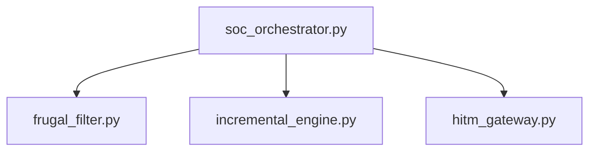

# 📜 Composants Techniques : Orchestrateur, Filtrage Frugal & Gateway HitM

## 📖 1. Résumé Exécutif & Glossaire

### 1.1 Objectif
Spécifier l'implémentation technique des modules logiciels de la Phase 8 assurant l'orchestration du SOC, le filtrage des flux et la passerelle de validation humaine.

### 1.2 Glossaire Métier & Technique
| Acronyme / Concept | Définition | Contexte DKG |
| :--- | :--- | :--- |
| **NER** | Named Entity Recognition | Extraction d'entités nommées pour le filtrage CTI. |
| **AsyncIO** | Bibliothèque Python asynchrone | Gestion des boucles de communication entre agents. |

## 🏗️ 2. Périmètre & Role de la Spécification
* **Positionnement dans l'Architecture :** Implémentation technique des agents logiciels et des passerelles d'E/S.
* **Gouvernance & Validation :** Validé par le Lead Dev / Architecte Technique.

📐 3. Spécifications Formelles & Règles
3.1 Contrats d'Interfaces Techniques

    soc_orchestrator.py expose les méthodes d'enchaînement des tâches d'audit.

    frugal_filter.py intègre le modèle GLiNER local et retourne un format structuré compatible Turtle.

    hitm_gateway.py gère l'invite de commande interactive ou l'API de validation.

📊 4. Matrice des Exigences & Critères d'Acceptation (EXG-)
Identifiant	Domaine	Intitulé de l'Exigence	Description & Critères d'Acceptation	Mode de Test / Asset
EXG-P8-05	TEC	API Asynchrone	Pilotage asynchrone avec timeout de 30s.	PyTest / AsyncIO Suite
EXG-P8-06	TEC	Pipeline NER Local	Exécution 100% Air-Gapped du modèle GLiNER.	PyTest / Air-Gapped Check
🛡️ 5. Outillage, CI/CD & Traçabilité Pytest

    Scripts de Génération / Exécution :

        03-Application/soc_orchestrator.py

        03-Application/frugal_filter.py

        03-Application/hitm_gateway.py

    Suites de Tests Associées : tests/test_soc_orchestrator.py

    Critères d'Acceptation : Validation de l'intégration continue par PyTest sans aucune connexion externe.

    Artefacts Produits : Fichiers logs d'exécution et rapports JSON de conformité.

📚 6. Documents Liés & Références

    SPC-FWK-P8-soc_orchestration_governance_01

    SPC-MET-P8-incremental_graph_partitioning_01