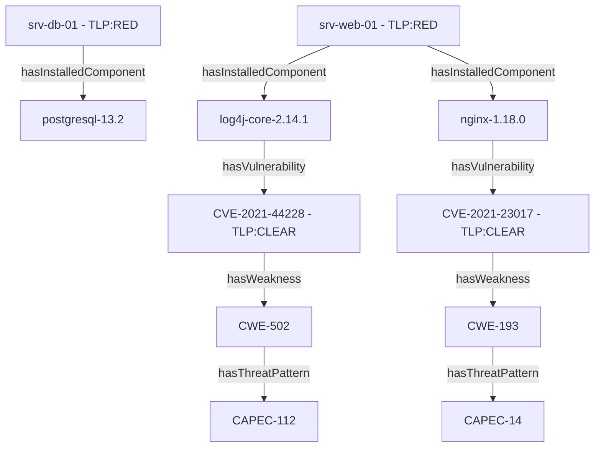

# 🔴 DKG Master ABox Consolidée - Graphe d'Attaque (TLP:RED)

> **Classification Globale** : `TLP:RED` (Strictement confidentiel - Usage interne restreint)  
> **Répertoire** : `12-Donnees/TLP_RED_Consolidation_ABox/`

## 📊 Synthèse des Instances Consolidées

| Entité / Concept | Nb Instances | Niveau TLP |
| :--- | :--- | :--- |
| **Équipements (Assets)** | 2 | `TLP:RED` |
| **Composants Logiques** | 3 | `TLP:RED` |
| **Vulnérabilités (CVE)** | 2 | `TLP:CLEAR` |
| **Faiblesses (CWE)** | 2 | `TLP:CLEAR` |
| **Patterns d'Attaque (CAPEC)** | 2 | `TLP:CLEAR` |

## 🌐 Visualisation du Graphe d'Attaque Consolidé

