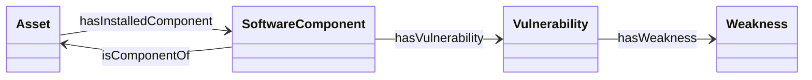

# 📗 Spécification de la TBox & RBox DKG (TLP:AMBER)

> **Statut** : Document d'Ontologie Généré Automatiquement
> **Namespace canonique** : `http://dkg.cybersec.org/tbox#`

## 📜 Glossaire & Acronymes Normatifs

| Acronyme | Nom Complet | Description |
| :--- | :--- | :--- |
| **TBox** | Terminology Box | Déclaration des classes, types et concepts de l'ontologie. |
| **RBox** | Relational Box | Déclaration des règles et propriétés d'objets (domaine, portée, inverses). |
| **ABox** | Assertion Box | Ensemble des instances et données concrètes (ex: serveurs réels, CVEs). |
| **CVE** | Common Vulnerabilities and Exposures | Dictionnaire des vulnérabilités de sécurité connues. |
| **CWE** | Common Weakness Enumeration | Système de classification des faiblesses software/hardware. |
| **CAPEC** | Common Attack Pattern Enumeration and Classification | Catalogues des schémas d'attaques employés par les adversaires. |

## 📊 Modèle Conceptuel (Diagramme Mermaid)

## 1. Classes Ontologiques (`owl:Class`)

| Classe | Libellé | Description |
| :--- | :--- | :--- |
| `dkg:Asset` | **Asset** | Équipement ou ressource de l'infrastructure informatique (ex: serveur, VM). |
| `dkg:SoftwareComponent` | **SoftwareComponent** | Composant logiciel ou brique applicative installée sur un Asset (ex: NGINX, OpenSSL). |
| `dkg:Vulnerability` | **Vulnerability** | Vulnérabilité ou faille de sécurité identifiée (ex: CVE). |
| `dkg:Weakness` | **Weakness** | Type de faiblesse logicielle sous-jacente (ex: CWE). |
| `dkg:ThreatPattern` | **ThreatPattern** | Modèle d'attaque ou pattern d'exploitation (ex: CAPEC). |

## 2. Propriétés d'Objets / Relations (`owl:ObjectProperty`)

| Relation | Domaine (`domain`) | Portée (`range`) | Axiome / Inverse |
| :--- | :--- | :--- | :--- |
| `dkg:hasInstalledComponent` | `dkg:Asset` | `dkg:SoftwareComponent` | - |
| `dkg:isComponentOf` | `dkg:SoftwareComponent` | `dkg:Asset` | `owl:inverseOf dkg:hasInstalledComponent` |
| `dkg:hasVulnerability` | `dkg:SoftwareComponent` | `dkg:Vulnerability` | - |
| `dkg:hasWeakness` | `dkg:Vulnerability` | `dkg:Weakness` | - |

## 3. Propriétés de Données (`owl:DatatypeProperty`)

| Propriété | Domaine (`domain`) | Type de Donnée (`range`) | Description |
| :--- | :--- | :--- | :--- |
| `dkg:hostname` | `dkg:Asset` | `xsd:string` | Nom d'hôte de l'équipement. |
| `dkg:ipAddress` | `dkg:Asset` | `xsd:string` | Adresse IP principale. |
| `dkg:componentName` | `dkg:SoftwareComponent` | `xsd:string` | Nom du produit logiciel. |
| `dkg:version` | `dkg:SoftwareComponent` | `xsd:string` | Version spécifique du composant. |
| `dkg:cvssScore` | `dkg:Vulnerability` | `xsd:float` | Score CVSS v3/v4 de gravité. |
| `dkg:cveId` | `dkg:Vulnerability` | `xsd:string` | Identifiant canonique CVE. |