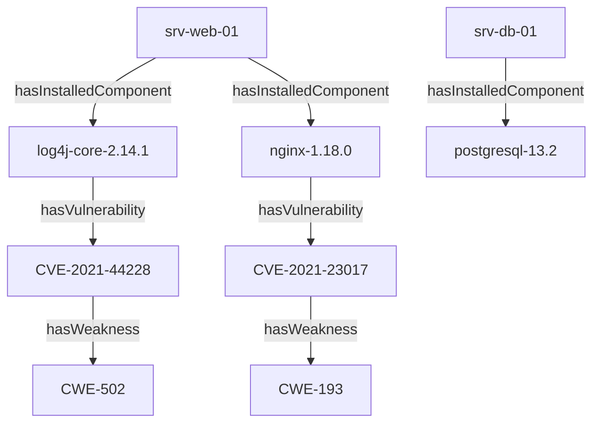

# 📙 Rapport de l'ABox DKG Initialisée (TLP:AMBER)

> **Statut** : Instances de Référence Générées Automatiquement
> **Namespace Instances** : `http://dkg.cybersec.org/abox#`

## 📊 Métriques du Jeu d'Instances

| Type d'Entité | Nombre d'Instances | Classe TBox Associée |
| :--- | :--- | :--- |
| **Assets** | 2 | `dkg:Asset` |
| **Composants Logiciels** | 3 | `dkg:SoftwareComponent` |
| **Vulnérabilités** | 2 | `dkg:Vulnerability` |

## 🌐 Graphe d'Instances (Vue Synthétique)

