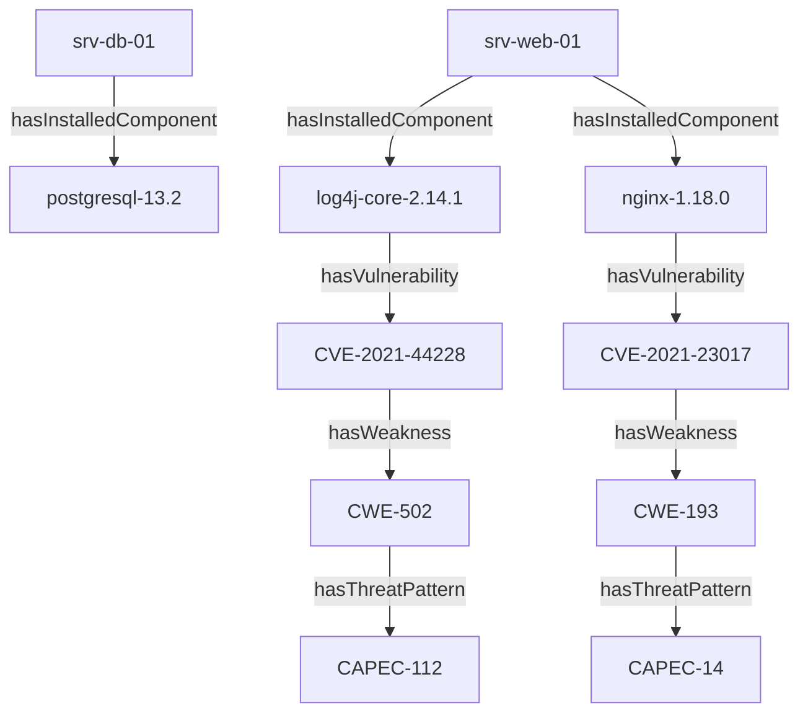

# 🚀 Rapport d'Enrichissement de l'ABox (NVD & MITRE CAPEC)

> **Statut** : ABox Enrichie (Phase 3)
> **Répertoire** : `12-Donnees/ABox_enriched/`

## 📊 Métriques d'Enrichissement Externe

| Indicateur | Valeur | Description |
| :--- | :--- | :--- |
| **Vulnérabilités Totales** | 2 | Total CVEs présentes dans l'ABox |
| **CVEs Enrichies NVD** | 2 | Vulnérabilités avec CVSS v3.1 & Sévérité |
| **Faiblesses CWE** | 2 | Classification des erreurs sous-jacentes |
| **Patterns d'Attaque (CAPEC)** | 2 | Total ThreatPatterns raccordés |
| **Taux de Couverture CAPEC** | 100% | Pourcentage de CWEs associées à au moins un CAPEC |

## 🌐 Chaine d'Enrichissement Complète (Asset ➔ CAPEC)

