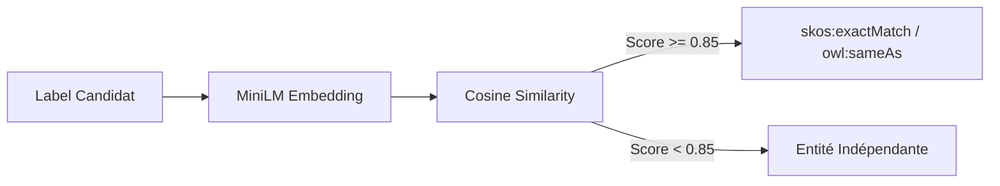

# 📑 Documentation Alignment Agent MITM - DKG_MITM_Test_Alignment

**Classification :** `TLP:AMBER`  
**Seuil de Similarité Cosinus :** `0.85`  
**Nombre de triplets produits :** `1`

---

## 📖 Glossaire & Table des Acronymes Métier

| Acronyme | Définition Complète | Contextualisation DKG |
| :--- | :--- | :--- |
| **MITM** | Man-In-The-Middle | Agent d'interception et d'alignement sémantique IA. |
| **NLP** | Natural Language Processing | Traitement automatique du langage via MiniLM. |
| **SKOS** | Simple Knowledge Organization System | Thésaurus d'alignement d'entités (`skos:exactMatch`). |
| **SSOT** | Single Source of Truth | Source unique de vérité (`config.py`). |

---

## 🔄 Flux d'Interception & Vectorisation IA

*Document généré automatiquement post-alignement MITM.*
