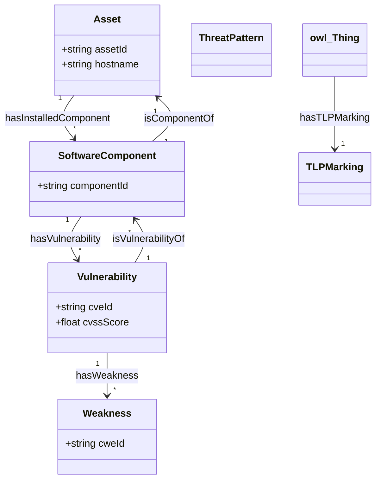

# 📚 Documentation du Socle Ontologique (Phase 1)

> **Classification** : `TLP:AMBER` | **Domaine** : CyberSécurité & DKG

---

## 📖 1. Glossaire des Acronymes

| Acronyme | Définition | Contextualisation |
| :--- | :--- | :--- |
| **TBox** | Terminological Box | Structure des classes et axiomes ontologiques |
| **RBox** | Role Box | Propriétés, rôles et axiomes d'inversion |
| **SKOS** | Simple Knowledge Organization System | Représentation lexicale et bilinguisme |
| **SHACL** | Shapes Constraint Language | Validation de contraintes de qualité sous CWA |
| **TLP** | Traffic Light Protocol | Protocole de partage de l'information |

---

## 📐 2. Architecture Graphique du Socle (Mermaid)

---

## 🏷️ 3. Résumé Synthétique des Classes TBox

| Classe | Label FR (`skos:prefLabel`) | Label EN | Définition (`skos:definition`) |
| :--- | :--- | :--- | :--- |
| `Asset` | Actif | Asset | Ressource informatique du SI (serveur, poste, équipement réseau). |
| `SoftwareComponent` | Composant Logiciel | Software Component | Composant logiciel, bibliothèque ou dépendance système. |
| `Vulnerability` | Vulnérabilité | Vulnerability | Faiblesse logicielle exploitable répertoriée (CVE). |
| `Weakness` | Faiblesse | Weakness | Famille d'erreur logicielle sous-jacente (CWE). |
| `ThreatPattern` | Schéma de Menace | Threat Pattern | Motif ou schéma d'attaque documenté (CAPEC). |
| `TLPMarking` | Marquage TLP | TLP Marking | Niveau de classification et de partage de l'information. |

---

## 🔗 4. Rôles et Inverses RBox

| Propriété | Domaine | Portée | Inverse (`owl:inverseOf`) | Libellé FR |
| :--- | :--- | :--- | :--- | :--- |
| `hasInstalledComponent` | `Asset` | `SoftwareComponent` | `isComponentOf` | a pour composant |
| `isComponentOf` | `SoftwareComponent` | `Asset` | `hasInstalledComponent` | est composant de |
| `hasVulnerability` | `SoftwareComponent` | `Vulnerability` | `isVulnerabilityOf` | a pour vulnérabilité |
| `isVulnerabilityOf` | `Vulnerability` | `SoftwareComponent` | `hasVulnerability` | impacte le composant |
| `hasWeakness` | `Vulnerability` | `Weakness` | N/A | est de type faiblesse |
| `hasTLPMarking` | `owl:Thing` | `TLPMarking` | N/A | a pour marquage TLP |

---

## 🛡️ 5. Validation SHACL (Contraintes de Surface)

| Shape Cible | Propriété contrôlée | Datatype | Contrainte CWA |
| :--- | :--- | :--- | :--- |
| `dkg:VulnerabilityShape` | `dkg:cvssScore` | `xsd:float` | `sh:maxInclusive 10.0` |
