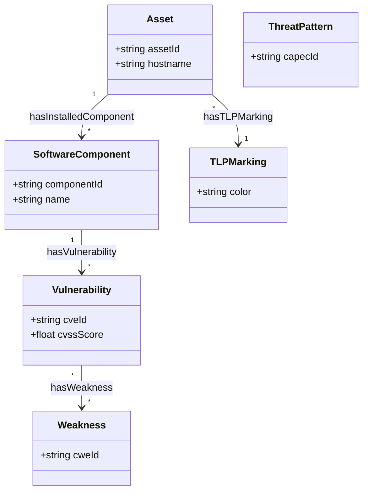

# 📚 Documentation du Socle Ontologique TBox / RBox / SKOS

> **Spécification** : Conforme SPEC-01  
> **Classification** : `TLP:AMBER`  
> **Domaine** : CyberSécurité & DKG

---

## 📖 1. Glossaire des Acronymes
* **TBox** : Terminological Box (Structure logique, classes et hiérarchies)
* **RBox** : Role Box (Propriétés, relations et leurs axiomes)
* **ABox** : Assertional Box (Données factuelles et instances)
* **OWL** : Web Ontology Language (Modélisation sémantique et logique)
* **SKOS** : Simple Knowledge Organization System (Gestion lexicale et multilingue)
* **SHACL** : Shapes Constraint Language (Validation de données ABox)
* **TLP** : Traffic Light Protocol

---

## 📊 2. Représentation Graphique du Schéma (Mermaid.js)

---

## 🏷️ 3. Dictionnaire des Classes (OWL & SKOS)

| Classe | Label FR (`skos:prefLabel`) | Label EN | Synonyme (`skos:altLabel`) | Définition (`skos:definition`) |
| :--- | :--- | :--- | :--- | :--- |
| `Asset` | Actif | Asset | Ressource SI | Ressource informatique du SI (serveur, poste, réseau). |
| `SoftwareComponent` | Composant Logiciel | Software Component | Paquet applicatif | Composant logiciel, bibliothèque ou dépendance système. |
| `Vulnerability` | Vulnérabilité | Vulnerability | Faille de sécurité | Faiblesse logicielle exploitable répertoriée (CVE). |
| `Weakness` | Faiblesse | Weakness | Type d'erreur logicielle | Famille d'erreur logicielle sous-jacente (CWE). |
| `ThreatPattern` | Schéma de Menace | Threat Pattern | Mode opératoire d'attaque | Motif ou schéma d'attaque documenté (CAPEC). |
| `TLPMarking` | Marquage TLP | TLP Marking | Niveau de confidentialité | Niveau de classification et de partage de l'information. |

---

## 🔗 4. Propriétés d'Objets (Object Properties & RBox)

| Propriété | Domaine | Portée (Range) | Inverse | Label FR | Description |
| :--- | :--- | :--- | :--- | :--- | :--- |
| `hasInstalledComponent` | `Asset` | `SoftwareComponent` | `isComponentOf` | a pour composant | Lie un actif aux logiciels installés |
| `isComponentOf` | `SoftwareComponent` | `Asset` | `hasInstalledComponent` | est composant de | Lie un composant à l'actif hôte |
| `hasVulnerability` | `SoftwareComponent` | `Vulnerability` | `isVulnerabilityOf` | a pour vulnérabilité | Associe un composant à ses vulnérabilités |
| `isVulnerabilityOf` | `Vulnerability` | `SoftwareComponent` | `hasVulnerability` | impacte le composant | Associe une CVE au composant impacté |
| `hasWeakness` | `Vulnerability` | `Weakness` | N/A | est de type faiblesse | Cartographie une CVE vers sa catégorie CWE |
| `hasTLPMarking` | `owl:Thing` | `TLPMarking` | N/A | a pour marquage TLP | Restreint la visibilité TLP d'un élément |

---

## 🔢 5. Propriétés de Données (Datatype Properties)

| Propriété | Domaine | Type (Datatype) | Label FR | Label EN |
| :--- | :--- | :--- | :--- | :--- |
| `assetId` | `Asset` | `xsd:string` | identifiant d'actif | asset identifier |
| `hostname` | `Asset` | `xsd:string` | nom d'hôte | hostname |
| `componentId` | `SoftwareComponent` | `xsd:string` | identifiant de composant | component identifier |
| `cveId` | `Vulnerability` | `xsd:string` | identifiant CVE | CVE identifier |
| `cvssScore` | `Vulnerability` | `xsd:float` | score CVSS | CVSS score |
| `cweId` | `Weakness` | `xsd:string` | identifiant CWE | CWE identifier |
