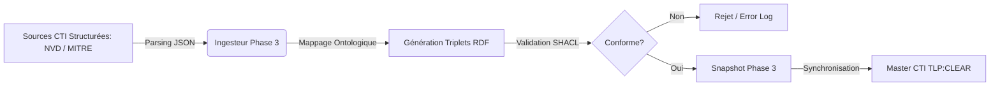
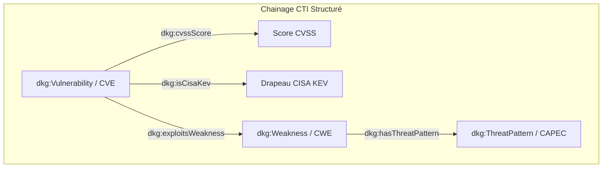

# 📑 Livrable Phase 3 - ABox CTI Externe & Référentiels Menaces

**Classification :** `TLP:CLEAR` (Public / Partageable)  
**Source Turtle :** `DKG_ABox_CTI_External.ttl`  
**Nombre total de triples RDF :** 22  

---

## 📖 Glossaire & Acronymes

| Acronyme | Définition Complète | Contextualisation DKG |
| :--- | :--- | :--- |
| **APT** | Advanced Persistent Threat | Groupe d'attaquants hautement qualifiés menant des attaques ciblées et prolongées. |
| **CISA KEV** | Known Exploited Vulnerabilities Catalogue | Registre des vulnérabilités exploitées activement. |
| **CTI** | Cyber Threat Intelligence | Renseignements structurés sur les menaces informatiques. |
| **CVE** | Common Vulnerabilities and Exposures | Dictionnaire public des vulnérabilités de sécurité connues. |
| **CWE** | Common Weakness Enumeration | Système de classification des faiblesses logicielles et matérielles. |
| **CAPEC** | Common Attack Pattern Enumeration and Classification | Référentiel des schémas et patterns d'attaque. |
| **CVSS** | Common Vulnerability Scoring System | Système standardisé d'évaluation de la sévérité des vulnérabilités. |
| **TLP** | Traffic Light Protocol | Norme de classification du niveau de partage de l'information. |
| **RDF** | Resource Description Framework | Modèle de données en graphe sous forme de triplets (Sujet-Prédicat-Objet). |

---

## 🔄 Flux d'Ingestion Structuré (Pipeline Phase 3)

---

## 📊 Synthèse des Entités CTI Ingestées

| Classe Schéma (`dkg:`) | Nombre d'Instances |
| :--- | :--- |
| `dkg:Vulnerability` | **2** |
| `dkg:ThreatPattern` | **2** |
| `dkg:Weakness` | **2** |

---

## 🔗 Cartographie du Référentiel CTI Externe

---

## 🔗 Détail des Dépendances Multi-Hop (CVE -> CWE -> CAPEC)

| Vulnérabilité (CVE) | Score CVSS | CISA KEV | Faiblesse (CWE) | Pattern d'Attaque (CAPEC) |
| :--- | :--- | :--- | :--- | :--- |
| `CVE-2021-44228` | `10.0` | ❌ Non | `CWE-502` | `CAPEC-586` |
| `CVE-2023-4863` | `8.8` | ❌ Non | `CWE-119` | `CAPEC-100` |

---
*Document généré automatiquement conformément aux exigences de livrables TLP:CLEAR.*