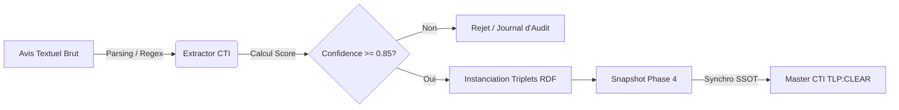
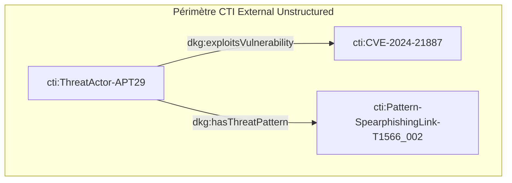

# 📑 Livrable Phase 4 - Ingestion CTI Non Structurée (ABox-U)

**Classification :** `TLP:CLEAR` (Public / Partageable)  
**Source Turtle :** `DKG_ABox_CTI_U_External.ttl`  
**Nombre total de triples RDF :** 12  

---

## 📖 Glossaire & Acronymes

| Acronyme | Définition Complète | Contextualisation DKG |
| :--- | :--- | :--- |
| **APT** | Advanced Persistent Threat | Groupe d'attaquants qualifiés menant des opérations ciblées. |
| **CTI** | Cyber Threat Intelligence | Renseignements structurés sur les menaces informatiques. |
| **CVE** | Common Vulnerabilities and Exposures | Référentiel des vulnérabilités publiques connues. |
| **TLP** | Traffic Light Protocol | Norme de restriction du partage de l'information. |
| **RDF** | Resource Description Framework | Modèle de représentation sous forme de graphes de triplets. |

---

## 🔄 Flux d'Ingestion & Validation Qualité

---

## 📊 Entités Extraites & Niveaux de Confiance

| URI Entité (`cti:`) | Classe (`dkg:`) | Libellé / Concept | Score Confiance |
| :--- | :--- | :--- | :--- |
| `CVE-2024-21887` | `dkg:Vulnerability` | CVE-2024-21887 | **0.99** |
| `ThreatActor-APT29` | `dkg:ThreatActor` | APT29 (`APT`) | **0.98** |
| `Pattern-SpearphishingLink-T1566_002` | `dkg:ThreatPattern` | Spearphishing Link (T1566.002) | **0.92** |

---

## 🔗 Topology Network Graph (Extraite)

---

## 🔗 Détail des Relations Extraites

| Menace (Threat Actor) | Vulnérabilité (CVE) | Pattern (ATT&CK) |
| :--- | :--- | :--- |
| `ThreatActor-APT29` | `CVE-2024-21887` | `Pattern-SpearphishingLink-T1566_002` |

---
*Document miroir généré automatiquement.*