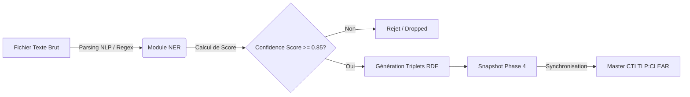
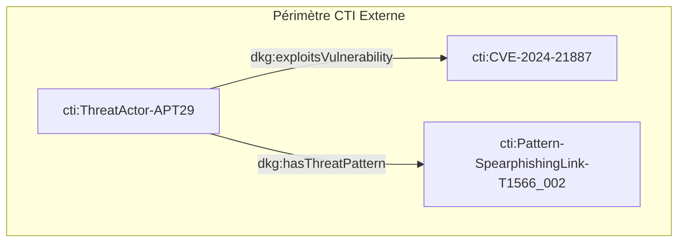

# 📑 Livrable Phase 4 - Extraction NER & CTI Non Structurée

**Classification :** `TLP:CLEAR` (Public / Partageable)  
**Source Turtle :** `DKG_ABox_CTI_External.ttl`  
**Nombre total de triples RDF :** 32  

---

## 📖 Glossaire & Acronymes

| Acronyme | Définition Complète | Contextualisation DKG |
| :--- | :--- | :--- |
| **APT** | Advanced Persistent Threat | Groupe d'attaquants hautement qualifiés menant des attaques ciblées et prolongées. |
| **NER** | Named Entity Recognition | Extraction automatique d'entités nommées depuis des bulletins CTI textuels. |
| **CTI** | Cyber Threat Intelligence | Renseignements structurés sur les menaces informatiques. |
| **CVE** | Common Vulnerabilities and Exposures | Dictionnaire public des vulnérabilités de sécurité connues. |
| **CAPEC** | Common Attack Pattern Enumeration and Classification | Référentiel des schémas et patterns d'attaque. |
| **TLP** | Traffic Light Protocol | Norme de classification du niveau de partage de l'information. |
| **RDF** | Resource Description Framework | Modèle de données en graphe sous forme de triplets (Sujet-Prédicat-Objet). |

---

## 🔄 Flux d'Ingestion MLOps (Pipeline NER)

---

## 📊 Entités Extraites par NER & Scores de Confiance

| URI Entité (`cti:`) | Classe (`dkg:`) | Libellé / Acronyme | Score Confiance NER |
| :--- | :--- | :--- | :--- |
| `CVE-2024-21887` | `dkg:Vulnerability` | CVE-2024-21887 | **0.99** |
| `ThreatActor-APT29` | `dkg:ThreatActor` | APT29 (`APT`) | **0.98** |
| `Pattern-SpearphishingLink-T1566_002` | `dkg:ThreatPattern` | Spearphishing Link (T1566.002) | **0.92** |
| `CVE-2021-44228` | `dkg:Vulnerability` | N/A | N/A (Socle) |
| `CVE-2023-4863` | `dkg:Vulnerability` | N/A | N/A (Socle) |
| `CAPEC-100` | `dkg:ThreatPattern` | Overflow Buffers | N/A (Socle) |
| `CAPEC-586` | `dkg:ThreatPattern` | Object Injection | N/A (Socle) |
| `CWE-119` | `dkg:Weakness` | N/A | N/A (Socle) |
| `CWE-502` | `dkg:Weakness` | N/A | N/A (Socle) |

---

## 🔗 Network Graph Extraite du Texte

---

## 🔗 Détail des Relations Multi-Hop

| Attaquant (Threat Actor) | Vulnérabilité Exploitée (CVE) | Motif d'Attaque (CAPEC/ATT&CK) |
| :--- | :--- | :--- |
| `ThreatActor-APT29` | `CVE-2024-21887` | `Pattern-SpearphishingLink-T1566_002` |

---
*Document généré automatiquement post-pipeline NER (Score Seuil >= 0.85).*