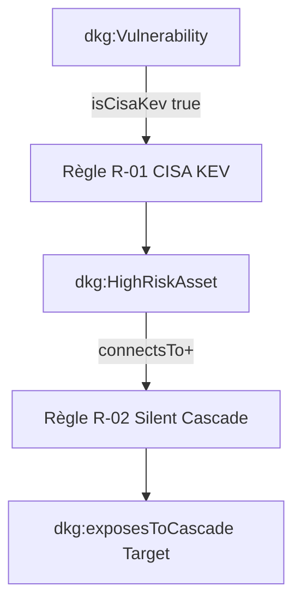

# 📑 Livrable Phase 5 - Raisonnement Sémantique & Inférences

**Classification :** `TLP:RED`  
**Nombre de faits déduits :** `3`

---

## 📖 Glossaire & Table des Acronymes Métier

| Acronyme | Définition Complète | Contextualisation DKG |
| :--- | :--- | :--- |
| **CISA** | Cybersecurity and Infrastructure Security Agency | Agence fournissant le catalogue KEV. |
| **KEV** | Known Exploited Vulnerabilities | Base des vulnérabilités activement exploitées. |
| **RBox** | Relationship Box | Moteur d'inférence de propriétés et cascades. |
| **TLP** | Traffic Light Protocol | Protocole de ségrégation des données. |

---

## 🔄 Cascade d'Inférence Sémantique (R-01 & R-02)

*Document généré automatiquement post-inférence.*
