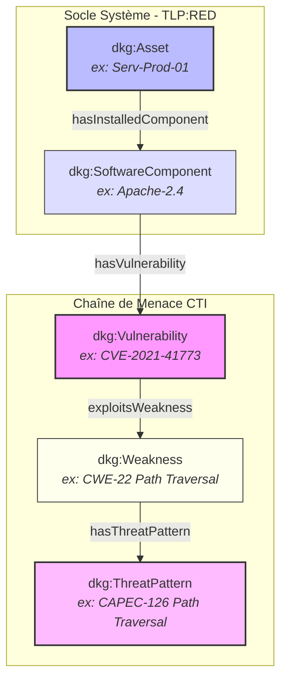

# 📑 Livrable ABox Master - DKG CyberSec

**Classification :** `TLP:RED` (Confidentiel)  
**Source Turtle :** `DKG_ABox_Master.ttl`  
**Nombre total de triples RDF :** 53  

---

## 📚 Glossaire des Acronymes

| Acronyme | Définition Complète | Description / Rôle dans le DKG |
| :--- | :--- | :--- |
| **ABox** | Assertion Box | Composant du Knowledge Graph contenant les faits et instances d'objets. |
| **TBox** | Terminology Box | Composant contenant les règles, ontologies, classes et propriétés du schéma. |
| **CTI** | Cyber Threat Intelligence | Renseignement sur les menaces informatiques pour anticiper les attaques. |
| **CVE** | Common Vulnerabilities and Exposures | Dictionnaire des failles de sécurité connues publiquement. |
| **CWE** | Common Weakness Enumeration | Système de classification des faiblesses logicielles et matérielles. |
| **CAPEC** | Common Attack Pattern Enumeration and Classification | Catalogue des schémas et tactiques d'attaque. |
| **SHACL** | Shapes Constraint Language | Langage de validation des structures de graphes RDF sous CWA. |
| **CWA** | Closed World Assumption | Hypothèse du monde clos. |

---

## 📊 Synthèse des Instances par Classe Schema

| Classe Schéma (`dkg:`) | Nombre d'Instances |
| :--- | :--- |
| `dkg:TLPMarking` | **4** |
| `dkg:Asset` | **2** |
| `dkg:ThreatPattern` | **2** |
| `dkg:Vulnerability` | **2** |
| `dkg:Weakness` | **2** |
| `dkg:SoftwareComponent` | **2** |

---

## 🧬 Représentation Visuelle de la Chaîne CTI (Diagramme Mermaid)

---

## 🔗 Cartographie Détaillée de l'ABox Master

| Asset | Composant | Vulnérabilité (CVE) | Faiblesse (CWE) | Threat Pattern (CAPEC) |
| :--- | :--- | :--- | :--- | :--- |
| `Asset-Srv-Auth-02` | `Comp-Log4j-2-14` | `CVE-2021-44228` | `CWE-78` | `CAPEC-63` |
| `Asset-Srv-Prod-01` | `Comp-Apache-2-4-49` | `CVE-2021-41773` | `CWE-22` | `CAPEC-126` |

---
*Document généré automatiquement conformément aux exigences de livrables TLP:RED.*