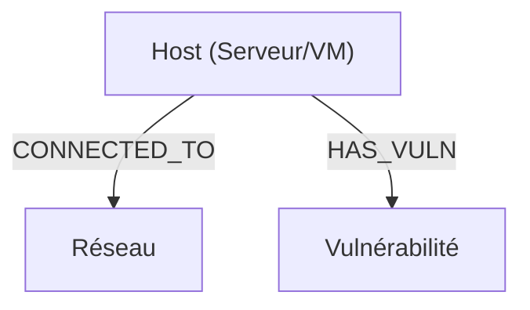

# 🛡️ Ontologie - Domaine Infrastructure

```mermaid
graph TD
    Host["Host (Serveur/VM)"] -->|CONNECTED_TO| Network["Réseau"]
    Host -->|HAS_VULN| Vulnerability["Vulnérabilité"]
```

*Régénération automatique depuis 3-App_Referential_Vault.*