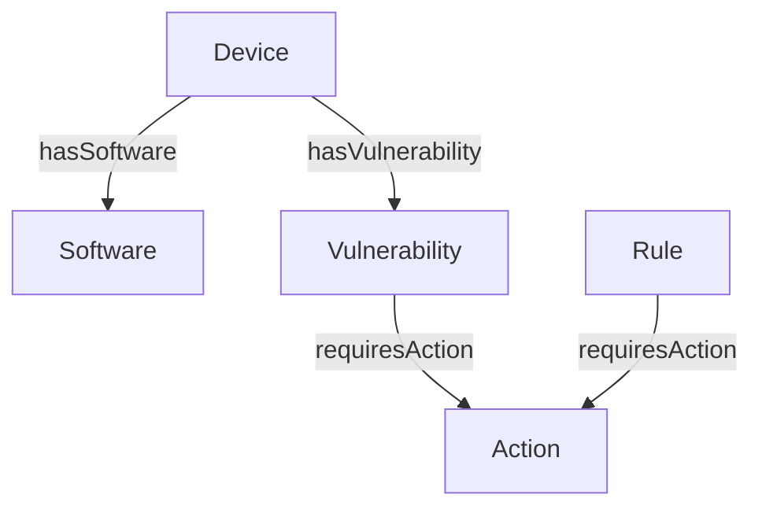

# 📐 Design de Phase 0 : POC Basique

## 🎯 Objectifs
- **Découvrir** les vulnérabilités dans un environnement personnel.
- **Comprendre** les bases de la modélisation en graphe.

## 📊 Modèle de Données

## 📌 Règles Métier

| Règle 001 | Si un device a une vulnérabilité avec CVSS > 7, appliquer une action corrective |
| --------- | ------------------------------------------------------------------------------- |
| Action    | Mettre à jour le logiciel concerné.                                             |

## 🔍 Exemple de Requête
```cypher
MATCH (d\:Device)-[\:HAS_SOFTWARE]->(s\:Software)<-[\:AFFECTED_BY]-(v\:Vulnerability)
WHERE v.cvssScore > 7.0
RETURN d.id AS device, s.name AS software, v.id AS cve, v.cvssScore AS score
```
