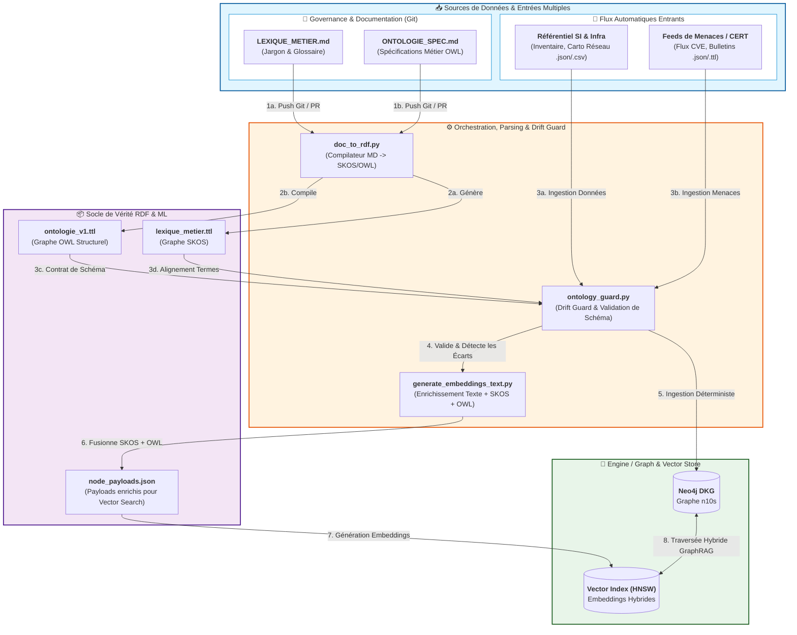

```mermaid
flowchart TD
    %% Subgraphs pour la séparation des responsabilités
    subgraph SOURCES ["📥 Sources de Données & Entrées Multiples"]
        direction TB
        subgraph HUMANS ["👥 Governance & Documentation (Git)"]
            MD_LEX["<b>LEXIQUE_METIER.md</b><br/>(Jargon & Glossaire)"]
            MD_ONTO["<b>ONTOLOGIE_SPEC.md</b><br/>(Spécifications Métier OWL)"]
        end
        
        subgraph AUTOMATED ["🔄 Flux Automatiques Entrants"]
            REF_DATA["<b>Référentiel SI & Infra</b><br/>(Inventaire, Carto Réseau .json/.csv)"]
            VULN_FEED["<b>Feeds de Menaces / CERT</b><br/>(Flux CVE, Bulletins .json/.ttl)"]
        end
    end

    subgraph CICD ["⚙️ Orchestration, Parsing & Drift Guard"]
        CONV["<b>doc_to_rdf.py</b><br/>(Compilateur MD -> SKOS/OWL)"]
        GUARD["<b>ontology_guard.py</b><br/>(Drift Guard & Validation de Schéma)"]
        SER["<b>generate_embeddings_text.py</b><br/>(Enrichissement Texte + SKOS + OWL)"]
    end

    subgraph ARTIFACTS ["📦 Socle de Vérité RDF & ML"]
        SKOS_TTL["<b>lexique_metier.ttl</b><br/>(Graphe SKOS)"]
        OWL_TTL["<b>ontologie_v1.ttl</b><br/>(Graphe OWL Structurel)"]
        TEXT_PAYLOADS["<b>node_payloads.json</b><br/>(Payloads enrichis pour Vector Search)"]
    end

    subgraph ENGINE ["🚀 Engine / Graph & Vector Store"]
        NEO4J[("<b>Neo4j DKG</b><br/>Graphe n10s")]
        VEC_IDX[("<b>Vector Index (HNSW)</b><br/>Embeddings Hybrides")]
    end

    %% Flux de données et d'exécution
    MD_LEX -->|1a. Push Git / PR| CONV
    MD_ONTO -->|1b. Push Git / PR| CONV
    
    CONV -->|2a. Génère| SKOS_TTL
    CONV -->|2b. Compile| OWL_TTL

    REF_DATA -->|3a. Ingestion Données| GUARD
    VULN_FEED -->|3b. Ingestion Menaces| GUARD
    OWL_TTL -->|3c. Contrat de Schéma| GUARD
    SKOS_TTL -->|3d. Alignement Termes| GUARD

    GUARD -->|4. Valide & Détecte les Écarts| SER
    GUARD -->|5. Ingestion Déterministe| NEO4J

    SER -->|6. Fusionne SKOS + OWL| TEXT_PAYLOADS
    TEXT_PAYLOADS -->|7. Génération Embeddings| VEC_IDX
    NEO4J <-->|8. Traversée Hybride GraphRAG| VEC_IDX

    %% Styling
    style SOURCES fill:#e1f5fe,stroke:#01579b,stroke-width:2px
    style HUMANS fill:#ffffff,stroke:#0288d1,stroke-width:1px
    style AUTOMATED fill:#ffffff,stroke:#0288d1,stroke-width:1px
    style CICD fill:#fff3e0,stroke:#e65100,stroke-width:2px
    style ARTIFACTS fill:#f3e5f5,stroke:#4a148c,stroke-width:2px
    style ENGINE fill:#e8f5e9,stroke:#1b5e20,stroke-width:2px
```