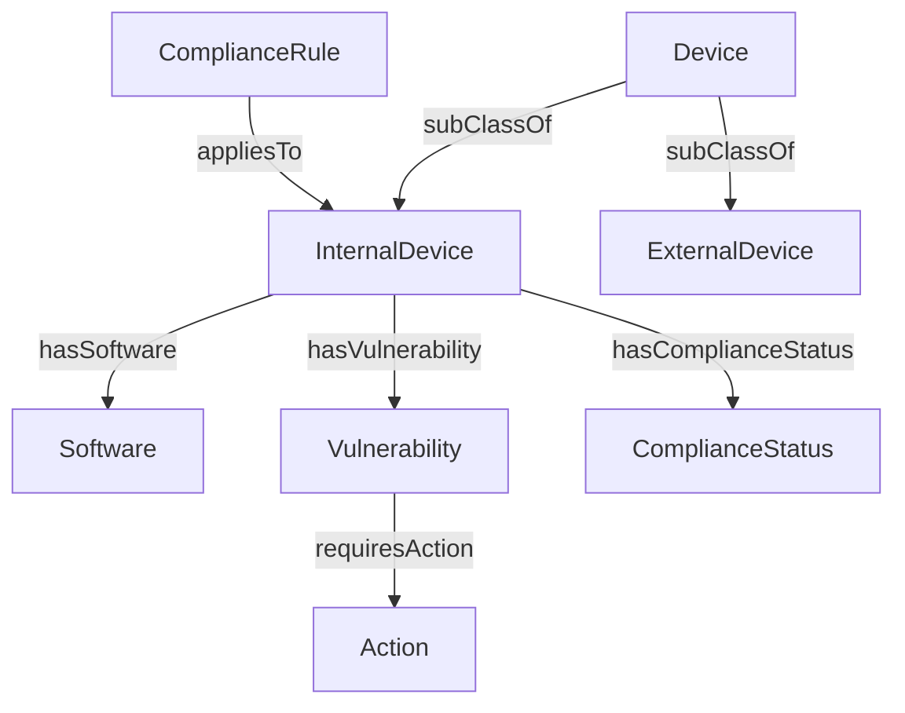

# 📐 Design de Phase 1 : Micro-Entreprise

## 🎯 Objectifs
- **Différencier** les devices internes/externes.
- **Ajouter des règles de conformité** (ex: CVSS < 5 pour les serveurs).
- **Préparer une contradiction** (Phase 2) : Que faire si un serveur a un CVSS > 5 ?

## 📊 Modèle de Données Étendu



## 📌 Règles Métier

| ID                  | Règle                      | Condition                    | Action                                                 |
| ------------------- | -------------------------- | ---------------------------- | ------------------------------------------------------ |
| Rule-001            | Mise à jour OpenSSL        | OpenSSL < 3.0                | Mettre à jour vers 3.0.8                               |
| Compliance-CVSS-Low | CVSS < 5 pour les serveurs | InternalDevice avec CVSS > 5 | **⚠️ PROBLÈME : Cette règle sera violée en Phase 2 !** |

requête utile
```cypher
// 1. Lister les devices non conformes
MATCH (d\:InternalDevice)-[\:hasComplianceStatus]->(s\:NonCompliant)
RETURN d.id AS device, s

// 2. Trouver les vulnérabilités critiques sur les serveurs
MATCH (d\:InternalDevice)-[\:HAS_VULNERABILITY]->(v\:Vulnerability)
WHERE v.cvssScore > 5.0
RETURN d.id AS device, v.id AS cve, v.cvssScore AS score
ORDER BY v.cvssScore DESC
```

## ⚠️ Préparation pour Phase 2
Problème identifié :

La règle Compliance-CVSS-Low exige que tous les InternalDevice aient un CVSS ≤ 5.
En Phase 2, un client externe (ExternalDevice) introduira une vulnérabilité critique sur un serveur interne.
Question : Faut-il :

Relâcher la règle (CVSS < 7) ?
Ajouter des exceptions (Waiver) ?
Différencier les contextes (Production vs. Test) ?

→ Réponse en Phase 2 : On ajoutera un contexte pour discriminer les situations.

