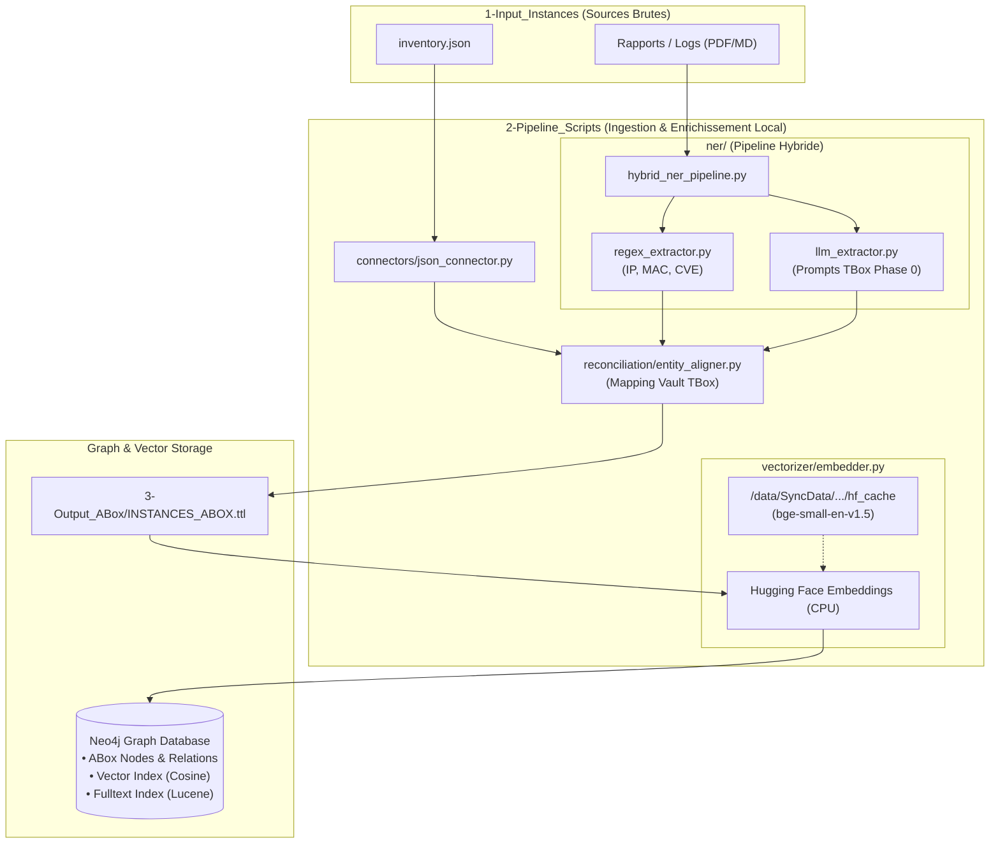

# 1 - Plan d'Architecture Détaillé - Phase 1 : Ingestion, Extraction (NER) & Hybrid RAG

- La Phase 0 a sécurisé le méta-modèle structurel (TBox / Ontologie / SKOS). 
- La **Phase 1** porte sur **l'instanciation intelligente des données réelles (ABox)** à partir de sources hétérogènes
	- fichiers JSON d'inventaire,
	- rapports de scan PDF/MD, 
	- logs, 
	- bases CVE/NVD.

## 1.1 - Vue d'Ensemble du Pipeline d'Ingestion
```
 [ Sources Brutes ] ──> [ Agent Ingestion ] ──> [ NER Pipeline ] ──> [ Normalisation ] ──> [ Vectorisation ] ──> [ Graph Neo4j + Vector Index ]
 (JSON, PDF, Logs)        (Multi-Format)        (LLM / Spacy)       (Mappage Vault)       (Embeddings)          (ABox + Hybride RAG)
```

## 1.2 - Composants Clés de la Phase 1
### A. Agent d'Ingestion Multi-Format (`ingestion_agent/`)
- **Rôle** : Charger, nettoyer et segmenter (_chunking_) les données brutes issues de différentes sources. 
- **Connecteurs** :
    - `json_connector.py` : Parsing d'inventaires réseau, configurations d'équipements (`inventory.json`).
    - `doc_connector.py` : Traitement des rapports de sécurité (PDF/Markdown) avec chunking sémantique par sous-sections.
    - `api_connector.py` : Récupération des flux de menaces externes (CVE, CISA KEV).
### B. Pipeline NER & Extraction de Connaissances (`ner_pipeline/`)
- **Rôle** : Identifier les entités nommées et leurs relations au sein des textes non structurés ou semi-structurés.
- **Entités Cibles** : `Equipment`, `Software`, `IP_Address`, `Vulnerability` (CVE-ID), `User`, `ThreatActor`.
- **Approche Hybride** :
    1. _Regex / Règles déterministes_ : IP, MAC, CVE-ID, ports, hashes.
    2. _LLM / NER guidé par le Schéma_ : Extraction d'entités complexes et de triplets `(Sujet, Predicat, Objet)` en respectant le schéma d'ontologie généré en Phase 0.
### C. Alignement & Normalisation Référentielle (`reconciliation/`)
- **Rôle** : Rattacher les instances extraites au réceptacle RDF de la Phase 0 pour éviter les doublons.
- **Mécanismes** :
    - _Entity Resolution / Disambiguation_ : Résolution des synonymes via le lexique SKOS (`skos:altLabel`).
    - _Reconciliation URIs_ : Génération d'URIs déterministes (ex: `EX:Software_Nginx_1_18_0`) pour l'alignement ABox/TBox.
### D. Vectorisation & Indexation Hybride (`vectorizer/`)
- **Rôle** : Générer des représentations vectorielles (embeddings) couplées aux nœuds du graphe pour le RAG Hybride (Recherche Vectorielle + Traversée de Graphe).
- **Technologie** :
    - Modèle d'embeddings textuels (ex: `text-embedding-3-small` ou modèle local HuggingFace).
    - Indexation vectorielle directement intégrée dans Neo4j (`Vector Index` sur les nœuds `Equipment`, `Vulnerability`, `DocumentChunk`).
## 1.3 - Arborescence Proposée (`02-Donnees/Phase1/`)

```
02-Donnees/Phase1/
├── 1-Input_Instances/            # Données d'entrées réelles (JSON, PDF, CSV, Logs)
│   ├── inventory.json
│   └── scan_vuln_2026.pdf
├── 2-Pipeline_Scripts/
│   ├── connectors/               # Ingestion multi-format
│   │   ├── base_connector.py
│   │   ├── json_connector.py
│   │   └── doc_connector.py
│   ├── ner/                      # Module NER & Extraction de Triplets
│   │   ├── regex_rules.py
│   │   └── llm_extractor.py
│   ├── reconciliation/           # Alignement avec Vault Phase 0
│   │   └── entity_aligner.py
│   ├── vectorizer/               # Embeddings et Indexation
│   │   └── embedder.py
│   └── orchestrator_phase1.py    # Pipeline global d'ingestion
├── 3-Output_ABox/                # Instances RDF sérialisées (.ttl)
│   └── INSTANCES_ABOX.ttl
└── 4-Graph_Store/                # Scripts Cypher d'instanciation Neo4j
    └── populate_instances.cypher
```

## 1.4 - Feuille de Route d'Implémentation (Phase 1)

1. **Jalon 1 : Agent d'Ingestion & NER Déterministe** (JSON + Regex IP/CVE/Software)
    
2. **Jalon 2 : Alignement d'Entités & Génération RDF ABox** (Lien ABox ➔ TBox Vault)
    
3. **Jalon 3 : Extraction LLM NER pour Fichiers Non Structurés** (PDF/MD)
    
4. **Jalon 4 : Vectorisation & Indexation Hybride Graph+Vector** (Neo4j Vector Search)


Voici la synthèse fonctionnelle et le guide d'exécution pour la Phase 1, optimisés pour votre environnement local Linux/Fedora et votre contrainte de stockage sur `/data/SyncData/`.

### 🔍 Synthèse des Fonctions du Pipeline Phase 1

1. **`connectors/base_connector.py` & `json_connector.py`** : Chargent les fichiers structurés d'inventaire (`inventory.json`), séparent les équipements physiques (`ex:Equipment`) des logiciels installés (`ex:Software`) et génèrent les premières instances ABox.
    
2. **`ner/regex_extractor.py`** : Extrait de manière déterministe et sans coût CPU les entités à motifs stricts (adresses IP, MAC, identifiants CVE, ports).
    
3. **`ner/llm_extractor.py`** : Extrait les triplets complexes `(Sujet, Prédicat, Objet)` via un prompt contraint par la TBox Phase 0 (modèle local/Ollama).
    
4. **`ner/hybrid_ner_pipeline.py`** : Orchestre la combinaison de la Regex et du LLM pour traiter les rapports non structurés (PDF/MD).
    
5. **`reconciliation/entity_aligner.py`** : Normalise les URIs des instances et associe l'ABox générée aux concepts de haut niveau du Vault Phase 0.
    
6. **`vectorizer/embedder.py`** : Calcule les embeddings textuels en local via Hugging Face (`BAAI/bge-small-en-v1.5`) en stockant le cache sur `/data/SyncData/` et alimente les index **Vector Search** et **Fulltext** de Neo4j.
    

### 🎨 Diagramme Mermaid (Architecture Phase 1)

Ce schéma synthétise le flux d'instanciation ABox à intégrer dans votre documentation design :



