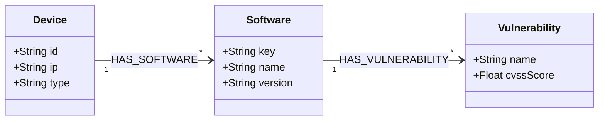
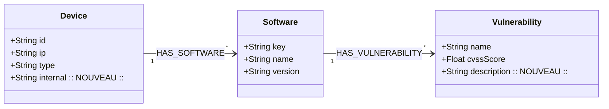

# 🛡️ Rapport d'Analyse d'Ingestion & Validation d'Ontologie

**Statut d'Ingestion :** `Cas 2 / Cas 3 : Écart d'ontologie détecté`

---

## 1. Bilan des Écarts Détectés

* **Nouvelles Classes Identifiées :** `Aucune`
* **Nouvelles Propriétés / Attributs :** `['description', 'name', 'Device.internal']`

---

## 2. Comparaison Visuelle (Diff Mermaid)

### Structure Actuelle (Avant / V0)


### Structure Proposée (Après / V1)


---

## 3. Snippet Turtle (`.ttl`) à intégrer dans `ontologie.ttl` 

```turtle
# ==========================================
# EXTENSION PROPOSÉE PHASE 1
# ==========================================

cyber:description a owl:DatatypeProperty ;
    rdfs:label "description" ;
    rdfs:range xsd:string .

cyber:name a owl:DatatypeProperty ;
    rdfs:label "name" ;
    rdfs:range xsd:string .

cyber:internal a owl:DatatypeProperty ;
    rdfs:label "internal" ;
    rdfs:range xsd:string .
```
