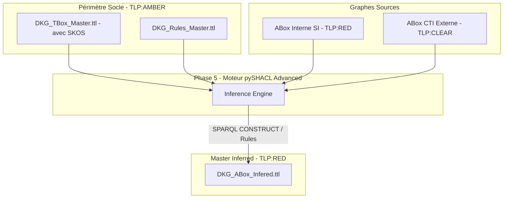

# 📑 Livrable Phase 5 - Inférence Sémantique & Unification du Graphe

**Classification :** `TLP:RED` (Confidentiel SI / Usage Interne)  
**Moteur d'Inférence :** pySHACL Advanced (Rules Engine)  
**Statut de Conformité SHACL :** ✅ CONFORME (PASS)

---

## 📖 Glossaire & Table des Acronymes Métier

| Acronyme | Définition Complète | Contextualisation DKG |
| :--- | :--- | :--- |
| **APT** | Advanced Persistent Threat | Groupe d'attaquants qualifiés (`dkg:ThreatActor`). |
| **CTI** | Cyber Threat Intelligence | Renseignements structurés externes (`TLP:CLEAR`). |
| **KEV** | Known Exploited Vulnerabilities | Catalogue CISA des vulnérabilités exploitées. |
| **SHACL** | Shapes Constraint Language | Langage W3C de validation de contraintes et de règles d'inférence. |
| **SKOS** | Simple Knowledge Organization System | Thésaurus de concepts sémantiques hébergé dans TBox Master. |
| **SSOT** | Single Source of Truth | Source de vérité unique de configuration (`config.py`). |
| **TLP** | Traffic Light Protocol | Protocole de partage (`TLP:CLEAR`, `TLP:AMBER`, `TLP:RED`). |

---

## 🔄 Flux d'Inférence Sémantique Cross-Domain



## 📊 Métriques d'Inférence

| Métrique | Valeur |
| :--- | :--- |
| **Triples Initiaux** | 176 |
| **Triples Déduits (Règles)** | +0 |
| **Total Triples Enrichis** | 176 |

---

## 🔍 Rapport Détaillé SHACL

```text
Validation Report
Conforms: True

```

*Document généré automatiquement post-pipeline Phase 5.*
