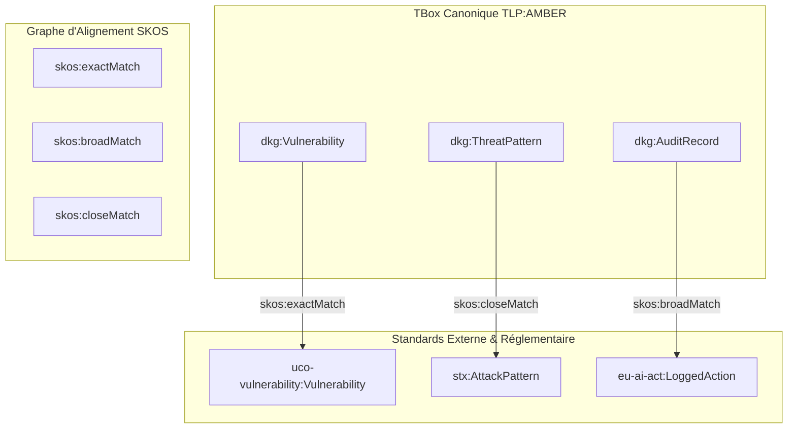

# Extrait Sémantique : DKG_SKOS_Master.ttl
**Source** : `02-Donnees/Snapshots_Phases/Phase5_Reasoning_MITM/DKG_SKOS_Master.ttl`  
**Nombre total de triplets** : `122`  

---
# 📚 Documentation & Capitalisation Sémantique : DKG SKOS Master (Phase 5)

## 📌 1. Lexique & Acronymes du Projet

| Acronyme | Définition Complète | Rôle dans l'Architecture DKG |
| :--- | :--- | :--- |
| **ABox** | *Assertion Box* | Base de faits contenant les instances concrètes du SI et de la CTI. |
| **CTI** | *Cyber Threat Intelligence* | Renseignements sur les menaces informatiques issus de sources internes ou externes[cite: 7, 8]. |
| **DKG** | *Dynamic Knowledge Graph* | Graphe de connaissances dynamique unifiant le modèle, les instances et les règles[cite: 7, 8]. |
| **MITM** | *Man-In-The-Middle* (Agent) | Agent autonome d'alignement et de médiation sémantique[cite: 7, 8]. |
| **OWL** | *Web Ontology Language* | Langage W3C de modélisation ontologique pour la TBox[cite: 8]. |
| **RDF** | *Resource Description Framework* | Modèle de données sous forme de triplets (Sujet, Prédicat, Objet)[cite: 7, 8]. |
| **SHACL** | *Shapes Constraint Language* | Langage de validation des formes et contraintes sur les graphes ABox[cite: 7, 8]. |
| **SKOS** | *Simple Knowledge Organization System* | Ontologie W3C pour l'alignement, les thésaurus et le mapping sémantique[cite: 7, 8]. |
| **SSOT** | *Single Source of Truth* | Source unique de vérité applicative (`config.py`)[cite: 7, 8]. |
| **TBox** | *Terminology Box* | Vocabulaire, concepts et ontologie canonique du projet (`TLP:AMBER`)[cite: 7, 8]. |
| **TLP** | *Traffic Light Protocol* | Norme de classification et de partage de l'information (CLEAR, AMBER, RED)[cite: 7, 8]. |
| **UCO** | *Unified Cyber Ontology* | Ontologie standard d'interopérabilité pour le domaine cyber[cite: 4, 6]. |

---

## 📐 2. Alignement Sémantique & Traçabilité (SKOS)

Le thésaurus SKOS permet d'établir les correspondances (*mappings*) entre les taxonomies externes (STIX 2, UCO 2, EU AI Act) et le vocabulaire TBox interne[cite: 4, 5, 6, 7].

---
## 1. Classes déclarées
* **`Asset`** (`Asset`): Ressource informatique du SI (serveur, poste, équipement réseau).
* **`SoftwareComponent`** (`SoftwareComponent`): Composant logiciel, bibliothèque ou dépendance système.
* **`TLPMarking`** (`TLPMarking`): Niveau de classification et de partage de l'information.
* **`ThreatActor`** (`Threat Actor`): Groupe ou entité menant des attaques ciblées (ex: APT).
* **`ThreatPattern`** (`ThreatPattern`): Motif ou schéma d'attaque documenté (CAPEC).
* **`Vulnerability`** (`Vulnerability`): Faiblesse logicielle exploitable répertoriée (CVE).
* **`Weakness`** (`Weakness`): Famille d'erreur logicielle sous-jacente (CWE).

## 2. Propriétés
* **`assetId`** [DatatypeProperty]: asset identifier
* **`componentId`** [DatatypeProperty]: component identifier
* **`cveId`** [DatatypeProperty]: CVE identifier
* **`cvssScore`** [DatatypeProperty]: CVSS score
* **`cweId`** [DatatypeProperty]: CWE identifier
* **`hasInstalledComponent`** [ObjectProperty]: has installed component
* **`hasTLPMarking`** [ObjectProperty]: has TLP marking
* **`hasThreatPattern`** [ObjectProperty]: has threat pattern
* **`hasVulnerability`** [ObjectProperty]: has vulnerability
* **`hasWeakness`** [ObjectProperty]: has weakness
* **`hostname`** [DatatypeProperty]: hostname
* **`isComponentOf`** [ObjectProperty]: is component of
* **`isVulnerabilityOf`** [ObjectProperty]: is vulnerability of
* **`nerConfidenceScore`** [DatatypeProperty]: NER Confidence Score

## 3. Échantillon de Triplets (Top 20)
| Sujet | Prédicat | Objet |
| :--- | :--- | :--- |
| `isComponentOf` | `inverseOf` | `hasInstalledComponent` |
| `TLPMarking` | `definition` | `Niveau de classification et de partage de l'information.` |
| `hasVulnerability` | `prefLabel` | `has vulnerability` |
| `Vulnerability` | `definition` | `Faiblesse logicielle exploitable répertoriée (CVE).` |
| `ThreatPattern` | `definition` | `Motif ou schéma d'attaque documenté (CAPEC).` |
| `hasWeakness` | `prefLabel` | `has weakness` |
| `hasTLPMarking` | `comment` | `Applique une classification TLP sur l'entité` |
| `Asset` | `label` | `Asset` |
| `TLPMarking` | `altLabel` | `Niveau de confidentialité` |
| `assetId` | `domain` | `Asset` |
| `isVulnerabilityOf` | `type` | `ObjectProperty` |
| `ThreatActor` | `prefLabel` | `Threat Actor` |
| `Vulnerability` | `prefLabel` | `Vulnerability` |
| `hasWeakness` | `prefLabel` | `est de type faiblesse` |
| `isVulnerabilityOf` | `prefLabel` | `is vulnerability of` |
| `hasVulnerability` | `comment` | `Lie un composant à une vulnérabilité connue` |
| `ThreatActor` | `type` | `Class` |
| `hasThreatPattern` | `domain` | `Weakness` |
| `ThreatPattern` | `altLabel` | `Mode opératoire d'attaque` |
| `cveId` | `range` | `string` |