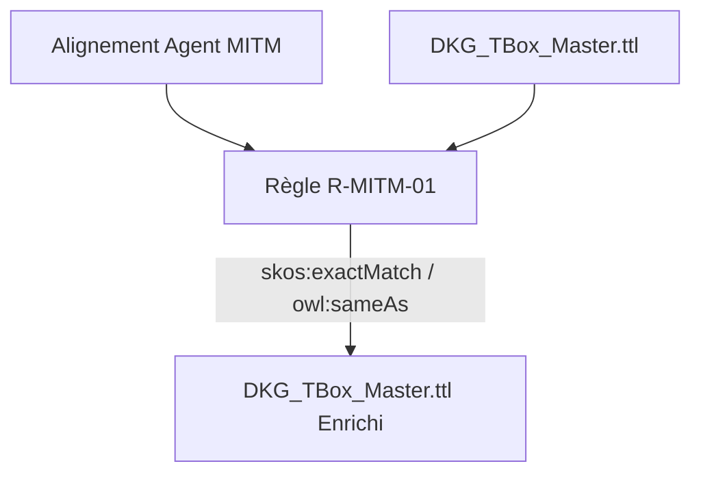

# 📑 Livrable Phase 5 - Consolidation SKOS au sein de TBox Master

**Classification :** `TLP:AMBER`  
**Nombre de triplets dans TBox Master :** `106`

---

## 📖 Glossaire & Table des Acronymes Métier

| Acronyme | Définition Complète | Contextualisation DKG |
| :--- | :--- | :--- |
| **OWL** | Web Ontology Language | Langage d'équivalence sémantique (`owl:sameAs`). |
| **SKOS** | Simple Knowledge Organization System | Normalisation du thésaurus (directement intégré dans TBox Master). |
| **SSOT** | Single Source of Truth | Source unique de vérité (`config.py`). |
| **TBox** | Terminology Box | Définition du schéma sémantique, des règles et des concepts. |

---

## 🔄 Flux de Consolidation SKOS / TBox Master

*Document généré automatiquement post-consolidation SKOS dans TBox Master.*
