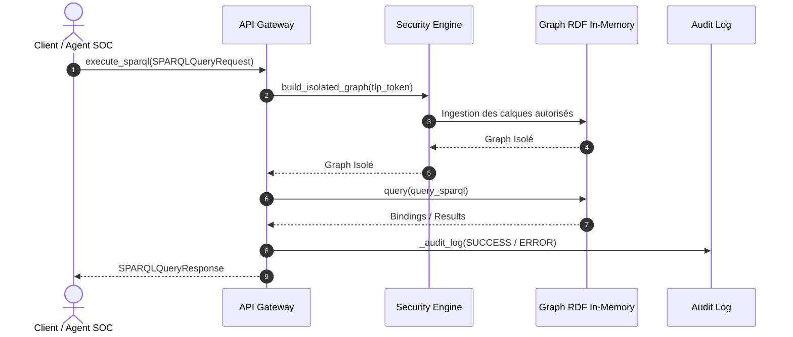

# Documentation Miroir — Phase 6 : API Gateway & Isolation TLP

## 1. Description Synthétique
La Phase 6 implémente le composant **API Gateway & Security Engine**. Elle garantit un filtrage d'accès dynamique au Knowledge Graph selon le protocole TLP (Traffic Light Protocol).

## 2. Diagramme de Séquence (Mermaid)

## 3. Glossaire des Acronymes

| **Acronyme** | **Définition Complète**                | **Rôle dans la Phase 6**                                       |
| ------------ | -------------------------------------- | -------------------------------------------------------------- |
| **API**      | Application Programming Interface      | Interface d'exposition SPARQL sécurisée.                       |
| **CWA**      | Closed World Assumption                | Validation sous monde clos sur le graphe assemblé.             |
| **DKG**      | Dynamic Knowledge Graph                | Graphe de connaissances unifié.                                |
| **RDF**      | Resource Description Framework         | Modèle de représentation en triplets (Sujet, Prédicat, Objet). |
| **SPARQL**   | SPARQL Protocol and RDF Query Language | Langage de requête d'extraction sur le DKG.                    |
| **SSOT**     | Single Source of Truth                 | Source unique de vérité (`config.py`).                         |
| **TLP**      | Traffic Light Protocol                 | Contrôle d'accès strict (CLEAR, AMBER, RED).                   |
