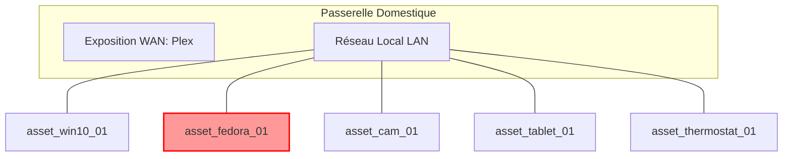

# 📄 Rapport d'Audit & SOC Résidentiel (`TLP:RED`)

## 1. Vue d'ensemble de la Passerelle
- **Box FAI :** `Box_FAI_Livebox`
- **Risque d'Exposition WAN :** `True`
- **Service Exposé :** `Plex Media Server`
- **Accès Wi-Fi Partagé/Invité :** `False`

## 2. Inventaire des Actifs Foyer (5 équipements)
### - `asset_win10_01` (PC Windows 10 Bureau)
- **OS / Firmware :** `Windows 10`
- **Adresse IP :** `192.168.1.10`
- **Services Locaux :**
  - `SMB` (Port: `445`, Statut: `Active`, CVE: `None`)
### - `asset_fedora_01` (PC Fedora 44 Plex)
- **OS / Firmware :** `Fedora 44`
- **Adresse IP :** `192.168.1.20`
- **Services Locaux :**
  - `Plex Media Server` (Port: `32400`, Statut: `Active`, CVE: `None`)
### - `asset_cam_01` (Caméra Surveillance IP)
- **OS / Firmware :** `Embedded Linux`
- **Adresse IP :** `192.168.1.50`
- **Services Locaux :**
  - `Telnet` (Port: `23`, Statut: `Exposed`, CVE: `None`)
### - `asset_tablet_01` (Tablette Android Enfants)
- **OS / Firmware :** `Android 9 (Obsolete)`
- **Adresse IP :** `192.168.1.100`
- **Services Locaux :**
### - `asset_thermostat_01` (Thermostat Connecté)
- **OS / Firmware :** `RTOS`
- **Adresse IP :** `192.168.1.200`
- **Services Locaux :**
  - `HTTP API Unauthenticated` (Port: `80`, Statut: `Exposed`, CVE: `None`)

## 3. Analyse des Risques & Chemins de Compromission (2 alertes détectées)
| Niveau | Actif | Description du Risque | Action Recommandée |
| :--- | :--- | :--- | :--- |
| **CRITICAL** | `asset_fedora_01` | Le serveur Plex est directement exposé sur le WAN via la Box FAI. | Désactiver l'UPnP et fermer la redirection de port WAN pour Plex. |
| **HIGH** | `asset_cam_01` | Service à haut risque détecté (Telnet) sur l'actif Caméra Surveillance IP. | Isoler l'équipement asset_cam_01 ou désactiver le service non sécurisé. |

## 4. Topologie & Vecteurs de Risque (Diagramme Mermaid)

