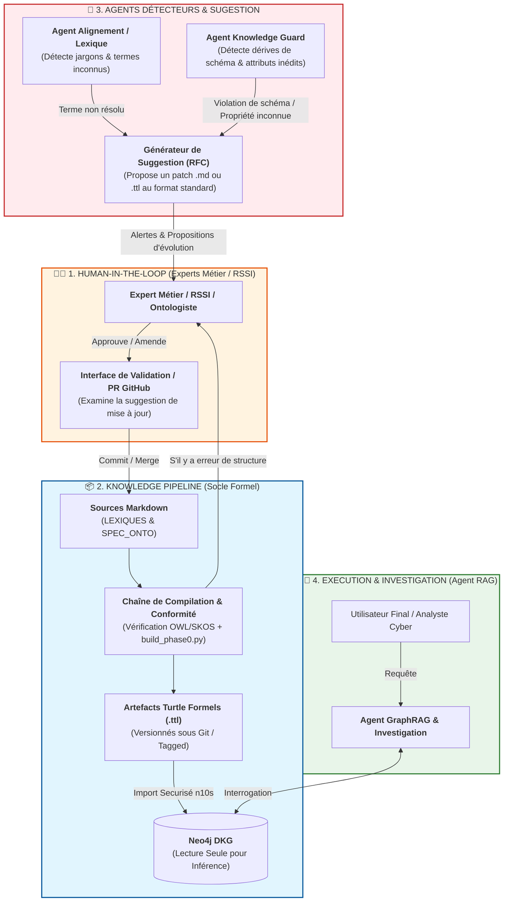

ici sera decrite l'architecture applicative et le principales fonctions associées.

Voici la proposition d'architecture unifiée. Elle associe la **chaîne de compilation des artefacts du DKG (socle de connaissances)** avec l'**architecture fonctionnelle des agents assistants cyber (couche d'exécution)**.

### 1. Vision d'Ensemble de l'Architecture Agentique DKG Cyber

L'architecture s'articule autour de quatre agents spécialisés interagissant avec le DKG à différents niveaux d'abstraction :

C'est une **vision fondamentale et cruciale** pour la gouvernance d'un Knowledge Graph en environnement critique (Cyber/RSSI). Vous décrivez là le principe du **"Human-in-the-Loop" (HITL)** gouverné : **aucun agent LLM/IA ne modifie directement et de manière autonome l'ontologie ou les lexiques**. L'IA propose, l'humain valide, et le système vérifie formellement la conformité avant le déploiement.

Voici l'architecture mise à jour qui intègre explicitement cette boucle de validation humaine (**HITL**) ainsi que la chaîne d'approbation et de compilation.

### 1. Schéma d'Architecture Mis à Jour (avec Boucle HITL)

### 2. Fonctionnement Découplé de la Boucle de Gouvernance

Ce mode de fonctionnement repose sur **3 règles d'or** :

#### Rule 1 : Détection Passive & Proposition Formelle (RFC)

- **Agent Lexique :** Si un utilisateur utilise un acronyme ou du jargon qu'il ne trouve pas dans `LEXIQUE_PUBLIC` ou `LEXIQUE_PRIVEE` après plusieurs tentatives, il crée un événement :
    
    `[NEW_JARGON_DETECTED] Terme="Bécane-Prod-02", Contexte="Serveur web", Confiance=0.85`
    
- **Agent Guard :** Si un flux de données entrant (ex: scan Nmap ou fichier d'inventaire JSON) contient un nouvel attribut non présent dans l'ontologie OWL (ex: `cpu_architecture`), il bloque l'ingestion stricte et émet :
    
    `[SCHEMA_DRIFT_DETECTED] Attribut Inconnu="cpu_architecture" sur la classe "cyber:Device"`
    
- **Action :** Les deux agents ne modifient **rien** en base. Ils génèrent une **Suggestion d'Évolution** (au format Markdown ou diff Git) envoyée à l'expert métier.
    

#### Rule 2 : Invalidation / Validation par l'Humain (HITL)

- L'expert métier / RSSI reçoit l'alerte sur son canal habituel (Issue GitHub, alerte Dashboard, ou PR automatique).
    
- L'expert valide ou rectifie la proposition (ex: _"D'accord pour ajouter `cpu_architecture`, mais le type doit être une chaîne normalisée, pas un nombre"_).
    

#### Rule 3 : Contrôle de Conformité Automatisé (CI/CD / Pipeline)

- Une fois l'approbation humaine validée dans les fichiers Markdown sources, le script de validation (`build_phase0.py` / `ontology_guard.py`) re-compile les `.ttl`.
    
- Il vérifie la **conformité de structure** (non-contradiction des classes, syntaxe RDF/Turtle valide, préfixes SKOS valides).
    
- Seule cette version compilée et validée est chargée dans Neo4j.
    

### 3. Fichier de Définition du Workflow Agentique à Conserver dans `01-Principes_Architecture/AGENTIQUE/StructureAgentique.md`

Pour que cette logique soit gravée dans l'architecture du projet, voici la section à intégrer dans la documentation :

Markdown

## 🛡️ Circuit de Gouvernance et Human-In-The-Loop (HITL)

Pour prévenir toute corruption ou dérive indésirable du Knowledge Graph :

1. **Isolation des Privilèges :** Les agents LLM disposent d'un accès en **lecture seule** sur le graphe Neo4j et sur les ontologies formelles `.ttl`.
2. **Mécanisme d'Alerte & Suggestion (RFC Agentique) :** 
   - L'Agent Lexique signale les termes ou acronymes non résolus.
   - L'Agent Guard bloque les données non conformes au schéma OWL et produit un rapport de dérive (*Schema Drift Report*).
3. **Arbitrage Humain (HITL) :** L'expert métier/RSSI révise et valide les suggestions sous forme de modification des fichiers sources Markdown (`LEXIQUE_*.md` ou `ONTOLOGIE_*.md`).
4. **Passage en Production :** La mise à jour des fichiers `.ttl` et du graphe Neo4j s'effectue exclusivement par la chaîne de CI/CD après vérification stricte de la conformité de structure.

  ---

OLD

   ---

### 2. Synthèse du Dossier `01-Principes_Architecture`

L'analyse des documents présents dans `01-Principes_Architecture` confirme une excellente maturité théorique sur laquelle s'appuient directement ces agents :

- **`AGENTIQUE/`**
    
    - _`Detecter un besoin de mise a jour de l'ontologie.md`_ & _`StructureAgentique.md`_ : Légitiment directement l'**Agent Guard** (détection proactive des dérives et des nouveaux attributs non documentés).
        
- **`ONTOLOGIE/`**
    
    - _`Agent_guard.md`_, _`TTL_OWL_GUIDE.md`_, _`ontologie-schema.md`_ : Posent les bases du contrat de structure OWL que l'**Agent Alignement** et l'**Agent Guard** utilisent pour garantir qu'aucune donnée invalide n'entre dans Neo4j.
        
- **`VECTORISATION/`**
    
    - _`embeddings.md`_, _`extraction de métadonnées depuis ontologie_v1.ttl pour la vectorisation.md`_ : Fournissent la méthodologie d'enrichissement sémantique nécessaire à l'**Agent GraphRAG** pour générer des représentations vectorielles hybrides (Nœud + Propriétés + Libellés SKOS).
        

### 3. Rôle Détaillé des 4 Agents Cyber Assistants

1. **Agent Alignement & Lexique (SKOS Resolver) :**
    
    - _Rôle :_ Intercepte le prompt ou le document entrant pour traduire le jargon, les acronymes ou les fautes de frappe vers les termes officiels via `skos:altLabel` et `skos:prefLabel`.
        
2. **Agent Knowledge Guard (Schema Enforcement) :**
    
    - _Rôle :_ Exécute la logique de `ontology_guard.py`. Il contrôle que toute nouvelle entité (issue de scans d'inventaire ou de flux CVE) respecte la structure OWL (publique ou privée) et signale l'éventuelle dérive de schéma.
        
3. **Agent GraphRAG & Investigation :**
    
    - _Rôle :_ Transforme la requête utilisateur alignée en requêtes Cypher optimisées. Il effectue des traversées multi-sauts (ex: _Machine $\rightarrow$ Vulnérabilité $\rightarrow$ Logiciel $\rightarrow$ Zone Réseau_).
        
4. **Agent Gouvernance & RSSI (Reporting) :**
    
    - _Rôle :_ Calcule l'exposition aux risques en croisant le schéma privé (périmètre PCI-DSS, criticités `entreprise:CriticalAsset`) avec les données publiques (score CVSS des vulnérabilités).