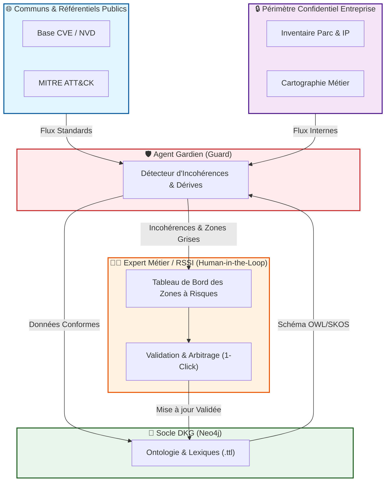
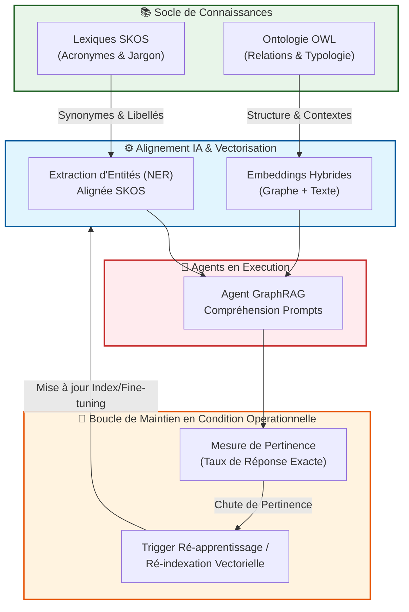
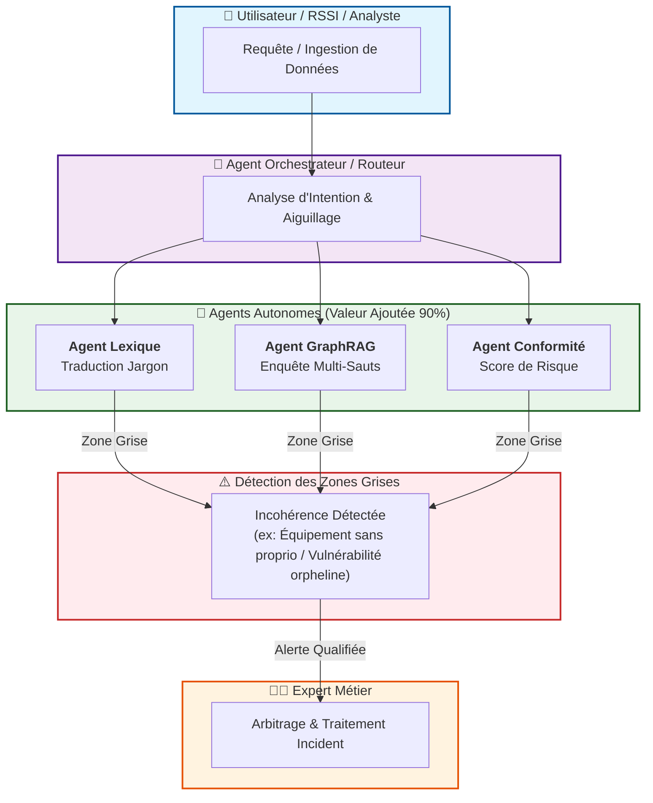
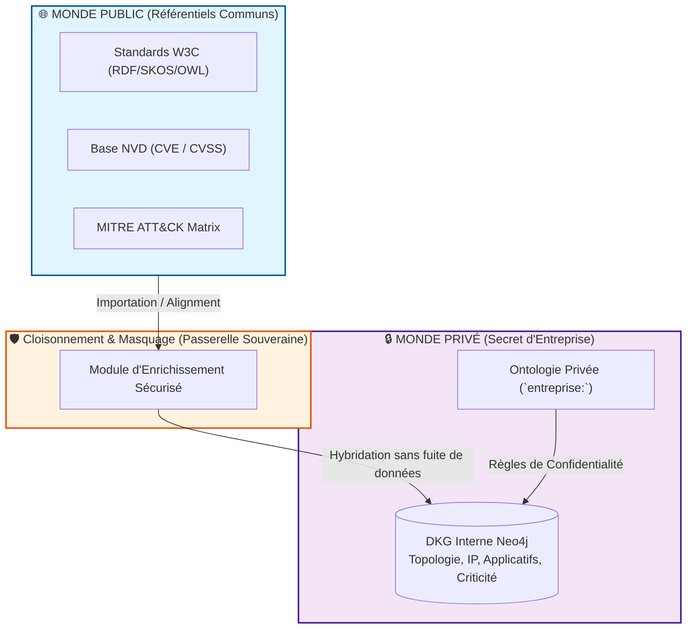

RepresentationDesPrincipesDKG

| **Zone / Couche**                         | **Couleur Mermaid**          | **Signification**                                      |
| ----------------------------------------- | ---------------------------- | ------------------------------------------------------ |
| **0. Humain / HITL / RSSI**               | `#fff3e0` (Orange/Ambre)     | Expertise, validation humaine, arbitrage zones grises. |
| **1. Référentiel Publique / Communs**     | `#e1f5fe` (Bleu clair)       | Données publiques, standards (CVE, MITRE, W3C, SKOS).  |
| **2. Référentiel Confidentiel / Interne** | `#f3e5f5` (Violet clair)     | Données métier, topologie privée, souveraineté.        |
| **3. Socle Modèle & Apprentissage**       | `#e8f5e9` (Vert clair)       | Ontologie, Lexiques, Fine-tuning, Embeddings, Graph.   |
| **4. Système Agentique**                  | `#ffebee` (Rouge/Rose clair) | Agents autonomes, détection, orchestration.            |

### Schéma 1 : Gouvernance du Referentiel (Guard, HITL & Zones à Risques)

**Message clé pour les décideurs :** _"L'IA ne dérive pas seule. L'expert métier conserve le contrôle total sur le socle de connaissances via un tableau de bord des zones à risques."_

### Schéma 2 : Boucle Dynamique d'Apprentissage & Pertinence (Embedding / NER)

**Message clé pour les équipe techniques/IA :** _"L'ontologie et les lexiques alimentent en continu les composants IA. Quand le métier évolue, ré-entraîner / ré-indexer garantit la précision."_

### Schéma 3 : Ecosystème d'Agents & Détection des "Zones Grises"

**Message clé pour le management :** _"Les agents gèrent l'essentiel de la valeur ajoutée en autonomie, mais savent lever la main dès qu'une zone grise (source de futurs incidents) est détectée."_

### Schéma 4 : Étancheité & Hybridation (Savoir Public vs. Secret Privé)

**Message clé pour la SSI / Sécurité des données :** _"Nous bénéficions de la puissance des standards publics sans jamais compromettre nos données sensibles."_

