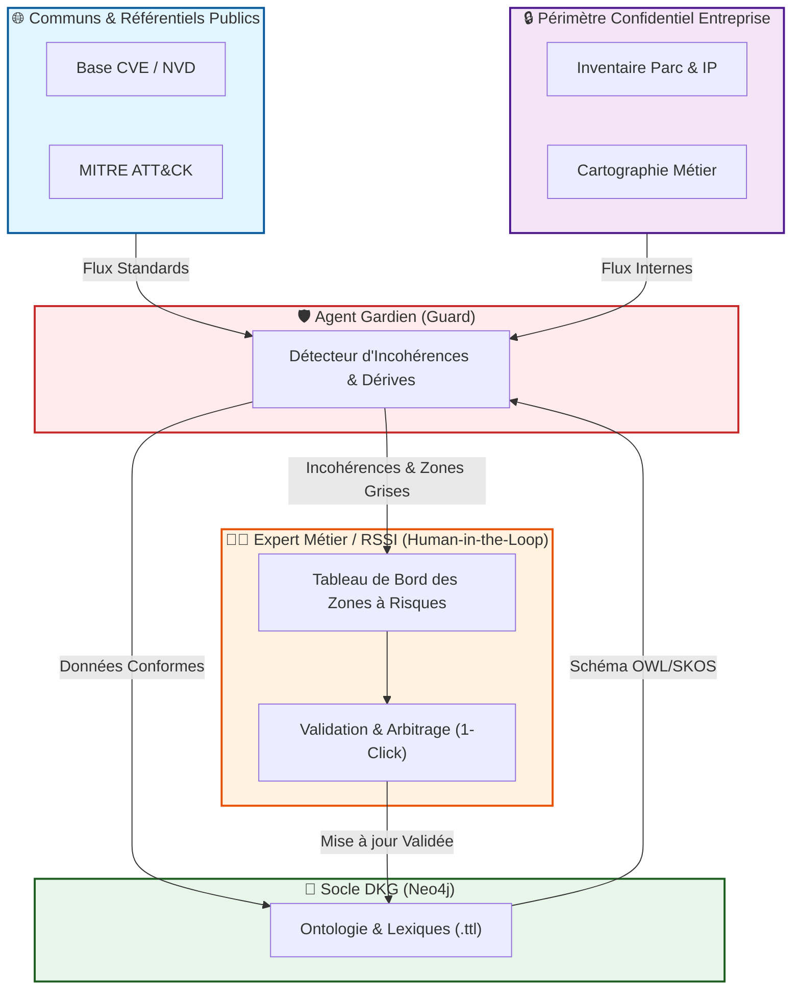
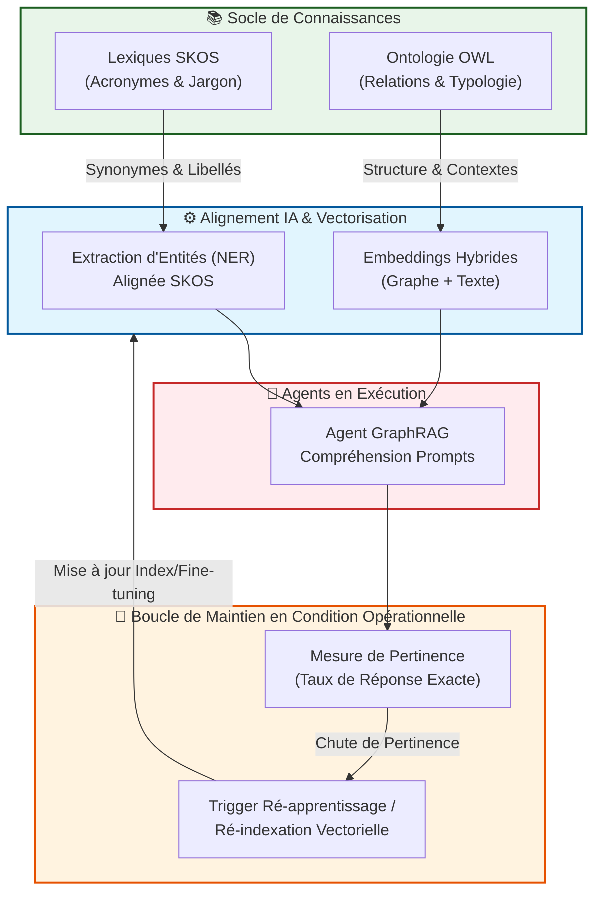
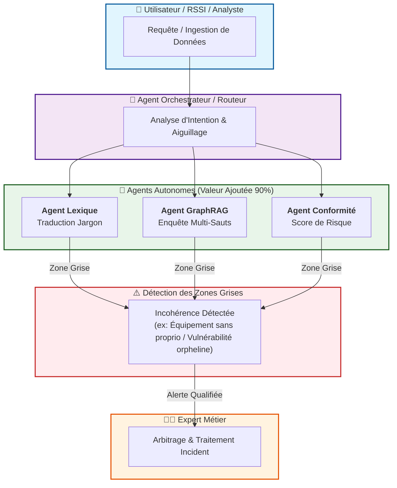
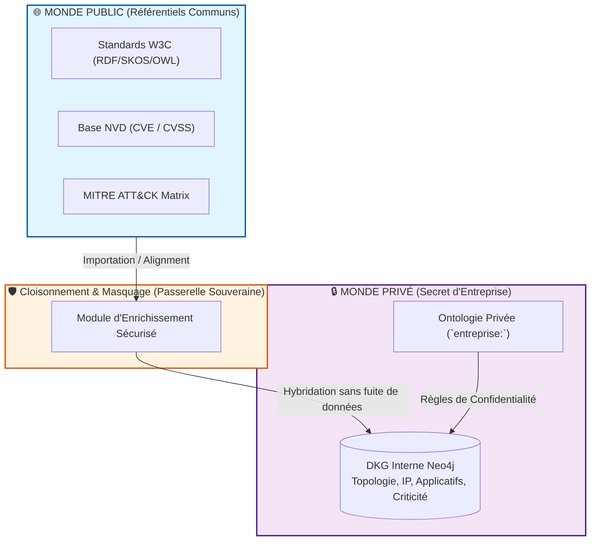

RepresentationDesPrincipesDKG
# 🏗️ Architecture Applicative & Principes Directeur du DKG Cyber

Ce document présente la vision globale de l'application **Cyber DKG (Dynamic Knowledge Graph)**. Il s'appuie sur quatre diagrammes de principes clés pour rendre l'architecture compréhensible et faciliter l'adoption du système par l'ensemble des parties prenantes (experts métier, RSSI, développeurs et analystes).

## 🎨 Charte Graphique des Schémas

Afin d'éviter la saturation visuelle et de faciliter la lecture rapide (notamment dans Obsidian), tous les schémas respectent la même charte de couleurs :

- **🟧 Orange / Ambre (`#fff3e0`) :** Couche Humain / HITL / RSSI (Arbitrage, validation, décision).
    
- **🟦 Bleu clair (`#e1f5fe`) :** Données publiques & Communs (CVE, MITRE, standards W3C).
    
- **🟪 Violet clair (`#f3e5f5`) :** Données confidentielles & Topologie interne entreprise.
    
- **🟩 Vert clair (`#e8f5e9`) :** Socle de connaissances (Ontologie, Lexiques, Graph Neo4j, Modèles).
    
- **🟥 Rose / Rouge (`#ffebee`) :** Système agentique & Détection dynamique.
    

## 1. Gouvernance du Référentiel & Contrôle Humain (HITL)

### Principe Pédagogique

> **« L'Intelligence Artificielle propose, l'humain valide. »**

L'IA et les agents automatisés ne modifient **jamais** directement le graphe de connaissances en autonomie totale. L'Agent Gardien (_Guard_) intercepte toutes les entrées et dérives de schéma. S'il détecte une incohérence, il émet un rapport d'alerte vers un tableau de bord consulté par l'expert métier. Seule l'action explicite de l'humain valide l'évolution de l'ontologie.

Extrait de code

## 2. Boucle Dynamique d'Apprentissage & Pertinence

### Principe Pédagogique

> **« Le socle formel pilote la précision du LLM et des modèles d'extraction. »**

L'ontologie OWL et les lexiques SKOS servent de référence pour la vectorisation (_embeddings_) et l'extraction d'entités (_NER_). En cas de baisse de pertinence ou d'évolution du vocabulaire de l'entreprise, une ré-indexation ou un ré-apprentissage est déclenché pour maintenir un niveau de précision optimal.

Extrait de code

## 3. Écosystème d'Agents & Traitement des Zones Grises

### Principe Pédagogique

> **« L'autonomie à 90%, l'escalade intelligente sur les 10% d'incertitude. »**

Les agents spécialisés (Alignement, GraphRAG, Gouvernance) traitent automatiquement l'immense majorité des requêtes à forte valeur ajoutée. Dès qu'une "zone grise" est détectée (ex. un serveur sans propriétaire identifié ou un acronyme ambigu), le système génère une alerte qualifiée plutôt que d'émettre une réponse fausse ou incertaine.

Extrait de code

## 4. Hybridation Public / Privé & Souveraineté des Données

### Principe Pédagogique

> **« Réutiliser les communs publics sans exposer les secrets internes. »**

Le système enrichit les connaissances internes grâce aux bases publiques (CVE, MITRE ATT&CK, ontologies W3C) à travers une passerelle cloisonnée. Les secrets d'entreprise (IPs internes, criticités des composants, noms de serveurs) restent hébergés dans le domaine privé sans risque de fuite vers l'extérieur.

Extrait de code

