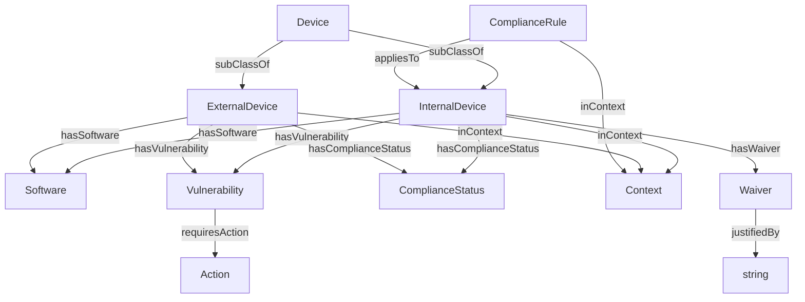

# 📐 Design de Phase 2 : Startup + RGPD

## 🎯 Objectifs
- **Résoudre la contradiction** entre la règle `Compliance-CVSS-Low` (CVSS < 5) et la réalité (Server-Prod a un CVSS 9.8).
- **Enrichir l’ontologie** avec des **contextes** et des **dérogations**.
- **Montrer la valeur de l’approche** :
  - **Éviter l’accumulation en vrac** (ex: ajouter une exception sans structure).
  - **Développer les nuances** (contexte, dérogations, justifications).
  - **Améliorer l’explicabilité** (pourquoi ce serveur est-il non conforme ?).

## 📊 Modèle de Données Final


## 🔍 Requêtes pour Analyser la Contradiction


```cypher
[200~// 1. Identifier les devices non conformes
MATCH (d\:InternalDevice)-[\:hasComplianceStatus]->(\:NonCompliant)
RETURN d.id AS device

// 2. Trouver la cause (CVE critique)
MATCH (d\:InternalDevice)-[\:HAS_VULNERABILITY]->(v\:Vulnerability)
WHERE v.cvssScore > 5.0
RETURN d.id AS device, v.id AS cve, v.cvssScore AS score
ORDER BY v.cvssScore DESC

// 3. Vérifier les dérogations
MATCH (d\:InternalDevice)-[\:HAS_WAIVER]->(w\:Waiver)
RETURN d.id AS device, w.id AS waiver, w.justifiedBy AS justification

// 4. Voir les règles par contexte
MATCH (r\:ComplianceRule)-[\:inContext]->(c\:Context)
RETURN r.name AS rule, c.label AS context, r.description AS description
```


## ✅ Résolution de la Contradiction

| Problème                                                       | Solution                                                                    | Avantage                                                                |
| -------------------------------------------------------------- | --------------------------------------------------------------------------- | ----------------------------------------------------------------------- |
| Server-Prod a un CVSS 9.8 (violation de `Compliance-CVSS-Low`) | Ajout d’une **dérogation** (Waiver) avec justification                      | **Explicabilité** : On sait pourquoi ce serveur est une exception.      |
| La règle `Compliance-CVSS-Low` est trop stricte                | Ajout d’un **contexte** (`ProductionContext`, `ExternalContext`)            | **Nuances** : On différencie les environnements.                        |
| Risque d’accumulation de règles contradictoires                | **Hiérarchie des contextes** (ex: `MigrationContext` > `ProductionContext`) | **Évolutivité** : On peut ajouter des contextes sans casser l’existant. |

## 📌 Leçons Apprises

L’ontologie doit évoluer pour capturer les nuances du réel.
Les contradictions sont normales : Elles révèlent des limites du modèle.
La résolution passe par :

L’enrichissement (ajout de classes/propriétés).
La structuration (contextes, hiérarchies).
La documentation (justifications, exceptions).


## 🔄 Impact sur la Vectorisation et les Modèles NER

_(Si vous utilisez du NLP pour extraire des règles depuis des documents)_

|Étape|Action|Impact|
|---|---|---|
|**Phase 0**|Vectorisation des documents basiques|Modèle simple (mots-clés : "vulnérabilité", "OpenSSL").|
|**Phase 1**|Ajout de règles internes|Modèle enrichi (mots-clés : "conformité", "CVSS", "règle interne").|
|**Phase 2**|Ajout de contextes/dérogations|**Réentraînement nécessaire** : Le modèle doit comprendre "contexte", "dérogation", "justification".|
|**Résultat**|Le graphe **guide l’enrichissement** des modèles NER : on identifie les **lacunes** (ex: absence de "contexte" dans Phase 1).||

→ Conclusion : Votre approche évite l’accumulation en vrac en :

Structurant les contradictions (via l’ontologie).
Documentant les nuances (contextes, dérogations).
Guidant l’évolution des modèles NER/vectorisation.


## 🎯 **Synthèse : Valeur de l’Approche**
| **Problème** | **Sans Ontologie Dynamique** | **Avec Votre Approche** | **Bénéfice** |
|-------------|-----------------------------|------------------------|-------------|
| **Contradiction** (ex: CVSS 9.8 en production) | On ajoute une exception **sans structure** → graphe incohérent. | On **enrichit l’ontologie** (Context, Waiver) → graphe explicite. | **Explicabilité** |
| **Évolution** (nouveaux devices) | On ajoute des nœuds **sans schéma** → données désorganisées. | On **met à jour l’ontologie** + migrations → données structurées. | **Maintenabilité** |
| **Règles complexes** | Les règles sont **isolées** → difficile à appliquer. | Les règles sont **liées au contexte** → application ciblée. | **Précision** |
| **Vectorisation/NER** | Les modèles **ignorent les nuances** → erreurs. | Les modèles **apprennent des nuances** (via l’ontologie) → meilleure précision. | **Qualité des données** |


## 📌 **Comment Utiliser Ces Phases dans Votre POC ?**
1. **Commencez par Phase 0** :
   - Chargez `ontologie.ttl` + `inventory.json` + `cve_data.ttl`.
   - Montrez un **graphe simple** (Device → Software → Vulnerability).

2. **Passez à Phase 1** :
   - Exécutez `to_phase1.cypher`.
   - Montrez l’**enrichissement** (InternalDevice, ComplianceRule).
   - Illustrez une **requête complexe** (ex: "Quels devices sont non conformes ?").

3. **Passez à Phase 2** :
   - Exécutez `to_phase2.cypher` puis `resolve_conflict.cypher`.
   - Montrez la **résolution de la contradiction** (Waiver, Context).
   - Expliquez comment cela **évite l’accumulation en vrac**.


Testez Phase 0 :

Chargez les données dans Neo4j.
Vérifiez avec :
cypher
Copier

MATCH (n) RETURN n LIMIT 10


Passez à Phase 1 :

Exécutez to_phase1.cypher.
Mettez à jour data/current/ pour pointer vers Phase1-Infrastructure/.


Passez à Phase 2 :

Exécutez to_phase2.cypher puis resolve_conflict.cypher.
Montrez la résolution de la contradiction.


👉 Cette simulation vous permet-elle de démontrer la valeur de votre approche ?
*(Si oui, je peux vous aider à :

Automatiser les migrations (script Python pour passer d’une phase à l’autre).
Ajouter des requêtes d’analyse pour chaque phase.
Documenter un guide pas-à-pas pour reproduire le POC.) 🚀


