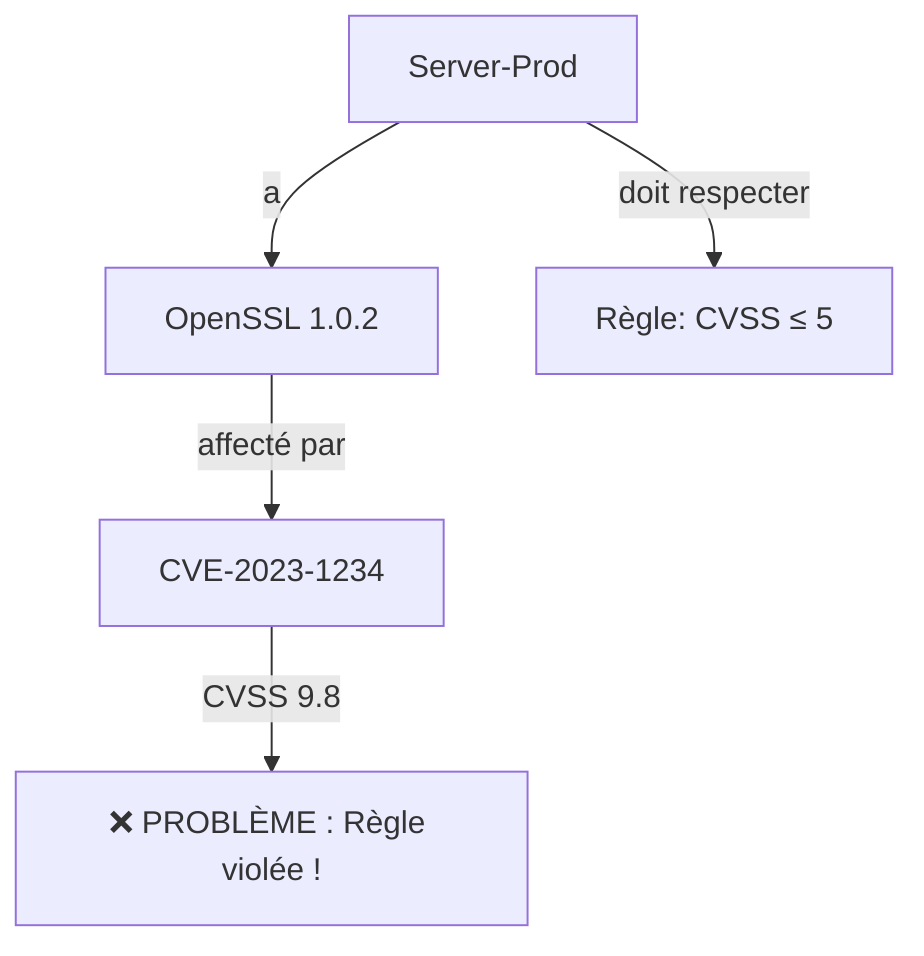
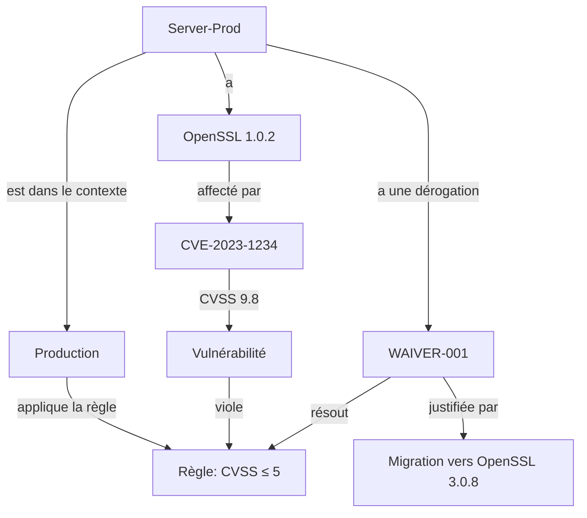

# Use Case  l'histoire de l'assistant Cyber

Ce cas d'usage doit permettre d'illustrer les enjeux d'un Assistant IA basé sur le Dynamic Knowledge Graph

Dynamique :
- on commence petit : usage local personnel et peu de fonctions cyber, puis on évolue jusqu'à une micro-entreprise avec un petit SOC (Securoty Operation Center)
- Les enjeux de la connaissance sont dans le détail de la sémantique et du context.  La notion de TBox "Terminology" Box qui évolue et sur laquels se basent les Agents

> *"Comment une simple règle de sécurité peut devenir un casse-tête...
> et comment une ontologie bien conçue permet de le résoudre."*

---

## 🎭 Personnages et Éléments Clés

| **Élément**                   | **Rôle**       | **Description**                                                  | **Exemple**                 |
| ----------------------------- | -------------- | ---------------------------------------------------------------- | --------------------------- |
| **Alban**                     | Administrateur | Gère un réseau qui évolue d’un usage personnel à une entreprise. | -                           |
| **PC-Alban**                  | Device         | PC personnel avec OpenSSL 1.0.2 et Apache 2.4.57.                | `id: "PC-Alban-POC"`        |
| **Router-Office**             | Device         | Routeur du réseau local.                                         | `id: "Router-POC"`          |
| **OpenSSL 1.0.2**             | Logiciel       | Version vulnérable (CVE-2023-1234, CVSS 9.8).                    | -                           |
| **CVE-2023-1234**             | Vulnérabilité  | Vulnérabilité critique dans OpenSSL 1.0.2.                       | `cvssScore: 9.8`            |
| **Server-Prod**               | InternalDevice | Serveur ajouté en Phase 1, avec PostgreSQL 15.3.                 | `id: "Server-Prod"`         |
| **Client-External-001**       | ExternalDevice | PC d’un client qui se connecte au réseau.                        | `id: "Client-External-001"` |
| **Règle RGPD-32**             | ComplianceRule | *"Tous les InternalDevice doivent avoir un CVSS ≤ 5."*           | -                           |
| **Contexte "Production"**     | Context        | Environnement critique (règles strictes).                        | -                           |
| **Contexte "Client Externe"** | Context        | Environnement moins contrôlé (tolérance plus élevée).            | -                           |

---

## 🌱 **Phase 1 : TBox  – "Un PC, Une Règle Simple"**
**Contexte** :

A ce stade on ne s'intéresse qu'au premiers conept :
- Assets  { materiel}
- SoftwareComponent {}
- Vulnerability {}
- Weakness {}

A mettre dans un referentiel Lexique, semantique et ontologique

**l'instanciation suivante ** :
1. Il **modélise son environnement** :
   - 1 PC (`PC-Alban-POC`) et 1 routeur (`Router-POC`).
   - 2 logiciels : OpenSSL 1.0.2 et Apache 2.4.57.
   - 1 vulnérabilité : CVE-2023-1234 (CVSS 9.8) liée à OpenSSL 1.0.2.
   - 1 règle : *"Mettre à jour OpenSSL vers 3.0.8"*.

2. Il **visualise les liens** :
   - `PC-Alban-POC` **→ hasSoftware →** `OpenSSL 1.0.2`
   - `OpenSSL 1.0.2` **→ affectedBy →** `CVE-2023-1234`
   - `CVE-2023-1234` **→ requiresAction →** *"Mettre à jour OpenSSL"*

**Résultat** :
✅ Alban comprend **immédiatement** que son PC est vulnérable.
✅ Il sait **quelle action prendre** (mettre à jour OpenSSL).

**Limites** :
❌ **Pas de différenciation** entre les devices (tout est traité de la même façon).
❌ **Pas de règles complexes** (seulement des actions correctives basiques).

---

## 🏢 **Phase 1 : La ABox initiale 

**Contexte** :

---
## 🧩 **illustration des enjeux de l’Ontologie**
### 🔴 **Sans Ontologie (Approche "En Vrac")**

→ Résultat :

On ajoute une exception manuelle dans un fichier Excel.
Personne ne sait pourquoi Server-Prod est une exception.
Impossible de reproduire la logique pour un nouveau serveur.

🟢 Avec Ontologie (Votre Approche)

→ Résultat :

Tout est structuré : On sait pourquoi Server-Prod est une exception.
Reproductible : La même logique s’applique à un nouveau serveur.
Évolutif : On peut ajouter de nouveaux contextes (ex: "Test") sans tout recoder.

🎯 Leçons Apprises

L’ontologie doit évoluer pour capturer les nuances du réel.
Les contradictions sont normales : Elles révèlent des limites du modèle.
La résolution passe par :

L’enrichissement (ajout de classes/propriétés comme :Context, :Waiver).
La structuration (hiérarchies, relations).
La documentation (justifications, exceptions).

.

