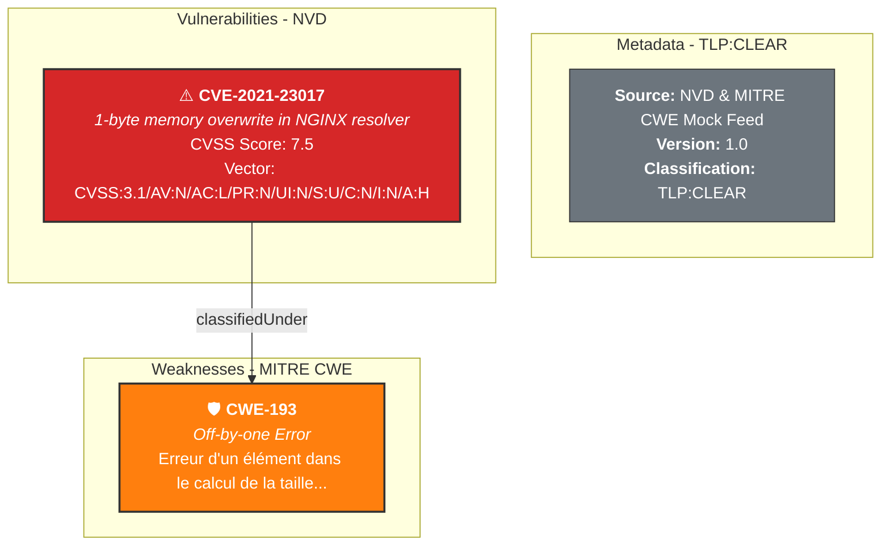

# Spécification Normative : Enrichissement RBox & Gouvernance de Confidentialité (Phase 3)

**Référence Documentaire :** `SPEC-RBOX-001`  
**Statut :** Normatif  
**Portée :** Phase 3 - Alignement Référentiels Publiques (CVE/CWE) et Isolation TLP  
**Dépendances :** 
- `12-Donnees/TBox_init/TBox_Cybersec.ttl` (ou `12-Donnees/TLP-AMBER_TBox_Cybersec/TBox_Cybersec.ttl`)
- `12-Donnees/ABox_init/ABox_Cybersec.ttl` (ou `12-Donnees/TLP-RED_ABox_Cybersec/ABox_Cybersec.ttl`)

---

## 1. Principes Directeurs & Confidentialité (TLP)

La Phase 3 poursuit un double objectif d'**enrichissement sémantique exogène** et de **gouvernance de la confidentialité**.


### Règles de Gouvernance TLP (Traffic Light Protocol)
* **RULE-SEC-01 (TLP-AMBER - Schéma TBox)** : Le modèle conceptuel et le dictionnaire sémantique (`12-Donnees/TLP-AMBER_TBox_Cybersec/`) sont restreints à l'interne.
* **RULE-SEC-02 (TLP-RED - Inventaire ABox)** : La cartographie d'équipements SI réels (`12-Donnees/TLP-RED_ABox_Cybersec/`) est strictement confidentielle.
* **RULE-SEC-03 (TLP-CLEAR - Référentiels RBox)** : Les failles (CVE) et taxonomies (CWE) universelles (`12-Donnees/TLP-CLEAR_RBox_NVD-CWE/`) sont publiques et libres de diffusion.

---

## 2. Modèle de Données & Mapping RDF RBox

L'enrichissement RBox doit mapper les données du feed JSON externe (`nvd_cwe_mock.json`) vers la structure RDF Turtle suivante :

| Champ JSON (`nvd_cwe_mock.json`) | Prédicat RDF (TBox Cible) | Type / Range RDF | Espace de Confidentialité |
|---|---|---|---|
| `vulnerabilities[].cve_id` | `rdf:type` $\rightarrow$ `dkg:Vulnerability` | Named Individual (`abox:` ou `nvd:`) | 🟢 TLP-CLEAR |
| `vulnerabilities[].label` | `rdfs:label` | Literal (`xsd:string` @fr / @en) | 🟢 TLP-CLEAR |
| `vulnerabilities[].cvss_score` | `dkg:cvssScore` | `xsd:float` | 🟢 TLP-CLEAR |
| `vulnerabilities[].cvss_vector` | `dkg:cvssVector` | `xsd:string` | 🟢 TLP-CLEAR |
| `vulnerabilities[].cwe_id` | `dkg:classifiedUnder` | Named Individual (`dkg:Weakness`) | 🟢 TLP-CLEAR |
| `weaknesses[].cwe_id` | `rdf:type` $\rightarrow$ `dkg:Weakness` | Named Individual (`cwe:`) | 🟢 TLP-CLEAR |
| `weaknesses[].label` | `rdfs:label` | Literal (`xsd:string` @fr) | 🟢 TLP-CLEAR |
| `weaknesses[].description` | `rdfs:comment` | Literal (`xsd:string` @fr) | 🟢 TLP-CLEAR |

---

## 3. Exigences d'Ingestion & Validation (EXG-RBOX)

* **EXG-RBOX-01 (Isolation des Fichiers)** : Les données d'enrichissement NVD/CWE doivent résider exclusivement dans `12-Donnees/TLP-CLEAR_RBox_NVD-CWE/RBox_Cybersec.ttl`.
* **EXG-RBOX-02 (Intégrité des Triplets)** : Chaque instance de type `dkg:Vulnerability` déclarée dans la RBox doit obligatoirement être rattachée à une instance `dkg:Weakness` (CWE).
* **EXG-RBOX-03 (Restitution Visuelle Markdown)** : Le script de génération doit sous-titrer les blocs Mermaid avec l'indicateur TLP correspondant pour identifier immédiatement le niveau de confidentialité de chaque nœud du graphe.

- **P3-1 (Alignement d'URI)** : Définir la règle de correspondance exacte (Match Key) entre les URIs de vulnérabilités produites par l'ABox (`rbox:CVE-...`) et le dictionnaire RBox NVD/CWE.
    
- **P3-2 (Résilience SPARQL)** : Imposer l'usage de blocs `OPTIONAL` structurés pour que l'absence d'une métadonnée externe (CVSS/CWE) ne masquât pas l'équipement ni la CVE en Phase 3.


### 2. Données Mock Exogènes (`nvd_cwe_mock.json`)

Ce fichier doit être placé sous :

`12-Donnees/TLP-CLEAR_RBox_NVD-CWE/nvd_cwe_mock.json`

```json

{
  "metadata": {
    "source": "NVD & MITRE CWE Mock Feed",
    "tlp_classification": "TLP:CLEAR",
    "version": "1.0"
  },
  "vulnerabilities": [
    {
      "cve_id": "CVE-2021-23017",
      "label": "1-byte memory overwrite in NGINX resolver",
      "cvss_score": 7.5,
      "cvss_vector": "CVSS:3.1/AV:N/AC:L/PR:N/UI:N/S:U/C:N/I:N/A:H",
      "cwe_id": "CWE-193"
    }
  ],
  "weaknesses": [
    {
      "cwe_id": "CWE-193",
      "label": "Off-by-one Error",
      "description": "Erreur d'un élément dans le calcul de la taille d'une boucle ou d'un tampon de mémoire."
    }
  ]
}
```