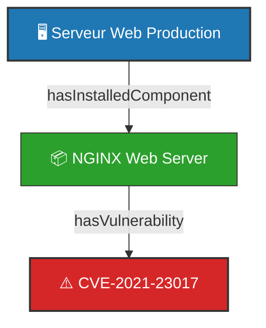

# Restitution Visuelle ABox - Cartographie des Instances SI

**Source :** `12-Donnees/ABox_init/ABox_Cybersec.ttl`  
**Nombre de Triplets RDF :** 15

---

## 1. Topologie du SI Privé (Diagramme Mermaid.js)

---

## 2. Inventaire Synthétique des Instances

| Type DKG | Identifiant Instance (URI) | Libellé / Label |
|---|---|---|
| `Ontology` | `abox:` | ABox Instance Graph - DKG Cybersec |
| `Asset` | `abox:srv-web-01` | Serveur Web Production |
| `Vulnerability` | `abox:CVE-2021-23017` | Vulnérabilité CVE-2021-23017 |
| `SoftwareComponent` | `abox:sw-nginx-1201` | NGINX Web Server |
