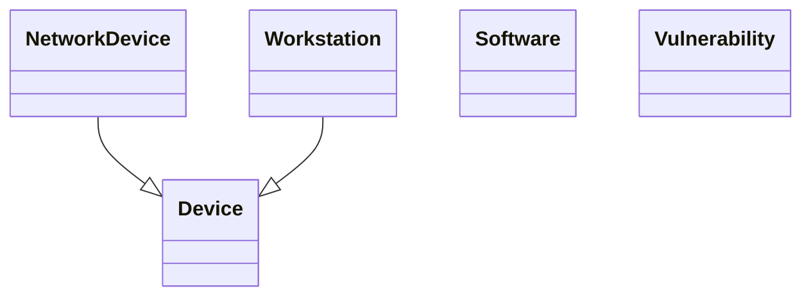

# Lexique & Ontologie - DKG
> *Généré le 2026-08-26 14:21*

---

## Lexique (Concepts Métiers)

| Concept | Label | Définition |
|---------|-------|------------|
| http://example.org/dkg/lexique#Device | Device | Équipement physique ou virtuel |
| http://example.org/dkg/lexique#NetworkDevice | NetworkDevice | Équipement réseau |
| http://example.org/dkg/lexique#Software | Software | Logiciel ou application |
| http://example.org/dkg/lexique#Vulnerability | Vulnerability | Faiblesse exploitable dans un système |
| http://example.org/dkg/lexique#Workstation | Workstation | Poste de travail |

---

## Ontologie (Classes)

---

## Statistiques
- Concepts SKOS: 5
- Classes OWL: 5