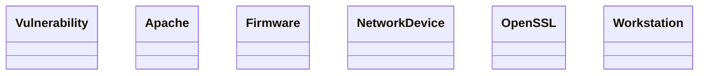

# Lexique & Ontologie - DKG
> *Généré le 2026-08-25 22:13*

---

## Lexique (Concepts Métiers)

| Concept | Label | Définition |
|---------|-------|------------|
| http://example.org/dkg/lexique#Apache | Apache |  |
| http://example.org/dkg/lexique#Firmware | Firmware |  |
| http://example.org/dkg/lexique#NetworkDevice | NetworkDevice |  |
| http://example.org/dkg/lexique#OpenSSL | OpenSSL |  |
| http://example.org/dkg/lexique#Workstation | Workstation |  |

---

## Ontologie (Classes)

---

## Statistiques
- Concepts SKOS: 5
- Classes OWL: 6