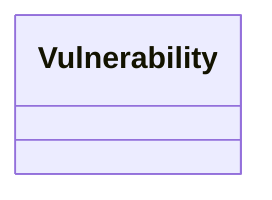

# Lexique & Ontologie - DKG
> *Généré le 2026-08-25 22:03*

---

## Lexique (Concepts Métiers)

| Concept | Label | Définition |
|---------|-------|------------|
| http://example.org/dkg/lexique#Vulnerability | Vulnérabilité |  |

---

## Ontologie (Classes)

---

## Statistiques
- Concepts SKOS: 1
- Classes OWL: 1