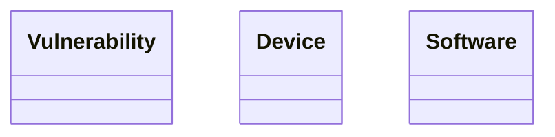

# Lexique & Ontologie - DKG
> *Généré le 2026-08-26 15:43*

---

## Lexique (Concepts Métiers)

| Concept | Label | Définition |
|---------|-------|------------|

---

## Ontologie (Classes)

---

## Statistiques
- Concepts SKOS: 0
- Classes OWL: 3