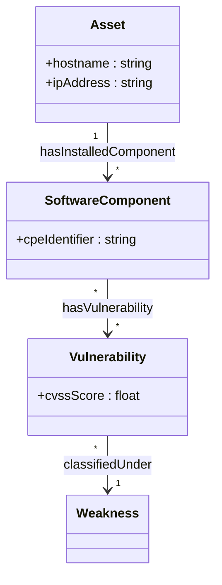
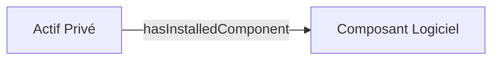
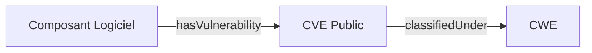

# Documentation Normative et Lexique de la TBox Cyberdéfense

Ce document est généré automatiquement depuis `TBox_Cybersec.ttl` conformément à la spécification `SpecificationNormativeSortiesFormatsTBox.md`.

## 1. Référentiel des Acronymes et Standards W3C / Cyber

| Acronyme | Nom Complet | Description / Rôle |
|---|---|---|
| **RDF** | Resource Description Framework | Modèle de données universel sous forme de triplets. |
| **RDFS** | RDF Schema | Extension de vocabulaire pour structurer classes et propriétés. |
| **OWL** | Web Ontology Language | Langage d'ontologie riche pour exprimer la sémantique. |
| **SKOS** | Simple Knowledge Organization System | Vocabulaire W3C pour thésaurus et lexiques (`skos:altLabel`). |
| **TTL** | Turtle | Formats de sérialisation texte lisible (Source de vérité). |
| **SPARQL** | SPARQL Query Language | Langage de requête pour graphes de connaissances. |
| **TBox** | Terminological Box | Schéma abstrait définissant concepts et relations. |
| **ABox** | Assertional Box | Ensemble des données réelles instanciées dans le SI. |
| **CPE** | Common Platform Enumeration | Dénomination unifiée des produits informatiques. |
| **CVE** | Common Vulnerabilities and Exposures | Dictionnaire public des vulnérabilités de sécurité. |
| **CWE** | Common Weakness Enumeration | Catégorisation des faiblesses d'architecture logicielle. |

## 2. Vues Graphiques de l'Ontologie (Mermaid.js)

### 2.1 Vue Synthétique Globale (Niveau 0)

### 2.2 Zoom Métier : Inventaire SI & Actifs (Niveau 1)

### 2.3 Zoom Métier : Threat Intelligence & CVE (Niveau 1)

## 3. Dictionnaire des Classes & Lexique Métier

| Concept | Libellé FR | Synonymes / Acronymes (SKOS) | Description |
|---|---|---|---|
| **Asset** | Actif Privé | `Host`, `Machine`, `Serveur`, `Équipement` | Équipement informatique physique ou virtuel du SI. |
| **Weakness** | Faiblesse Logicielle | `CWE`, `Faiblesse` | Catégorisation des erreurs de conception/code. |
| **SoftwareComponent** | Composant Logiciel | `Application`, `CPE`, `OS`, `Package` | Brique logicielle ou système d'exploitation installé. |
| **Vulnerability** | Vulnérabilité | `Breche`, `CVE`, `Faille` | Faille de sécurité répertoriée publiquement. |

## 4. Dictionnaire des Relations et Attributs

| Propriété | Domaine (Origine) | Range (Cible) | Libellé FR |
|---|---|---|---|
| `classifiedUnder` | Vulnerability | Weakness | classé sous faiblesse |
| `hasInstalledComponent` | Asset | SoftwareComponent | a composant installé |
| `hasVulnerability` | SoftwareComponent | Vulnerability | présente vulnérabilité |