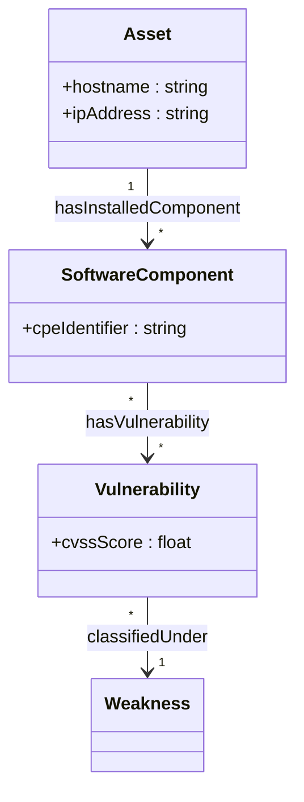
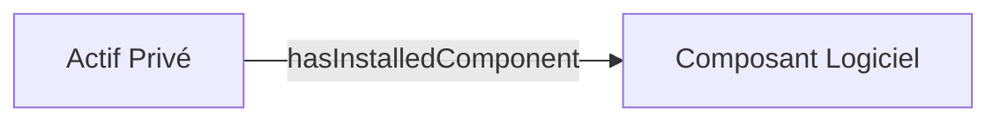
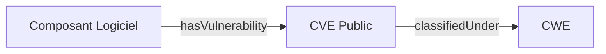

# Documentation et Modélisation Visuelle de la TBox

## 1. Schéma Visuel Synthétique (Niveau Global)

## 2. Zoom Métier : Domaine Système & Inventaire SI (Niveau 1)

## 3. Zoom Métier : Domaine Cyber & Threat Intelligence (Niveau 1)

## 4. Dictionnaire des Classes & Synonymes Métier

| Concept | Libellé | Synonymes / Acronymes | Description |
|---|---|---|---|
| **Asset** | Actif Privé | Machine, Serveur, Host, Équipement | Équipement physique ou virtuel du SI privé. |
| **SoftwareComponent** | Composant Logiciel | CPE, Package, Application | Composant logiciel ou OS installé sur un actif. |
| **Vulnerability** | Vulnérabilité | CVE, Breche, Faille | Vulnérabilité référencée dans la base publique. |
| **Weakness** | Faiblesse (CWE) | - | Type d'erreur ou catégorie de faiblesse logicielle. |

## 5. Relations et Attributs

| Propriété | Origine | Cible | Libellé |
|---|---|---|---|
| `hasInstalledComponent` | Asset | SoftwareComponent | a pour composant |
| `hasVulnerability` | SoftwareComponent | Vulnerability | est affecté par la vulnérabilité |
| `classifiedUnder` | Vulnerability | Weakness | est catégorisé sous CWE |
| `hostname` | Asset | string | Nom d'hôte |
| `ipAddress` | Asset | string | Adresse IP |
| `cpeIdentifier` | SoftwareComponent | string | Identifiant CPE |
| `cvssScore` | Vulnerability | float | Score CVSS |