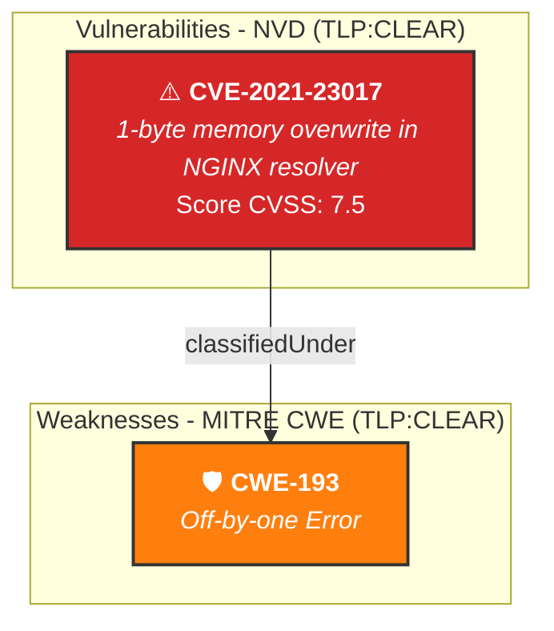

# Restitution Visuelle RBox - Référentiel Externe (Open Data)

**Classification :** `TLP:CLEAR`  
**Source :** `12-Donnees/TLP-CLEAR_RBox_NVD-CWE/RBox_Cybersec.ttl`  
**Nombre de Triplets RDF :** 12

---

## 1. Graphe d'Enrichissement RBox (Mermaid.js)

---

## 2. Dictionnaire des Vulnérabilités & Faiblesses

| Type DKG | Identifiant | Libellé / Score |
|---|---|---|
| `Ontology` | `rbox:` | RBox Public Reference Graph - DKG Cybersec |
| `Vulnerability` | `rbox:CVE-2021-23017` | 1-byte memory overwrite in NGINX resolver |
| `Weakness` | `rbox:CWE-193` | Off-by-one Error |
