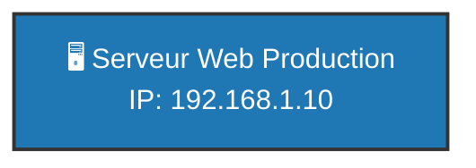

# Restitution Visuelle ABox Privée (TLP:RED)

**Classification :** `TLP:RED` (Strictement Restreint)  
**Source RDF :** `12-Donnees/TLP-RED_ABox_Cybersec/ABox_Cybersec.ttl`  

---

## 1. Topologie du SI Privé

