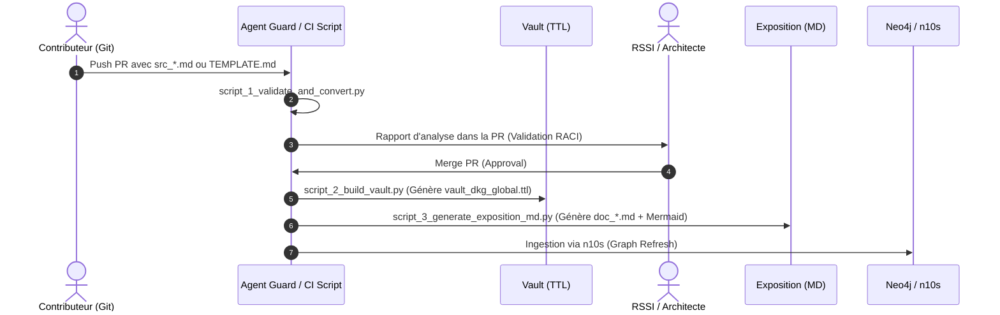

```mermaid
sequenceDiagram
    autonumber
    actor C as Contributeur (Git)
    participant AG as Agent Guard / CI Script
    participant V as Vault (TTL)
    actor R as RSSI / Architecte
    participant EX as Exposition (MD)
    participant N as Neo4j / n10s

    C->>AG: Push PR avec src_*.md ou TEMPLATE.md
    AG->>AG: script_1_validate_and_convert.py
    AG->>R: Rapport d'analyse dans la PR (Validation RACI)
    R->>AG: Merge PR (Approval)
    AG->>V: script_2_build_vault.py (Génère vault_dkg_global.ttl)
    AG->>EX: script_3_generate_exposition_md.py (Génère doc_*.md + Mermaid)
    AG->>N: Ingestion via n10s (Graph Refresh)
```
