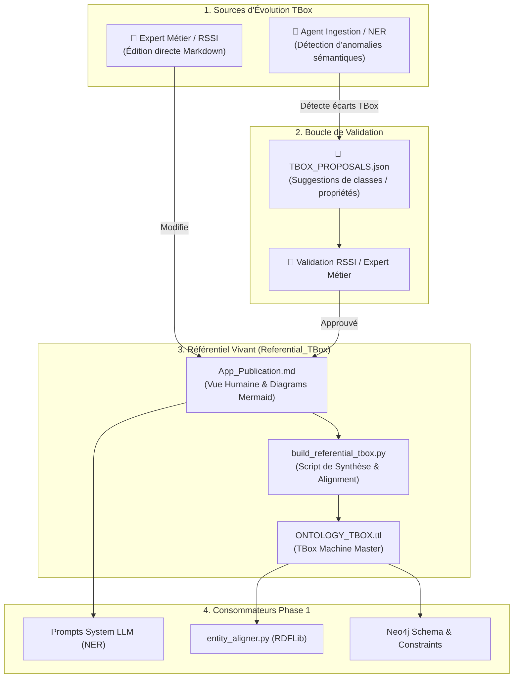
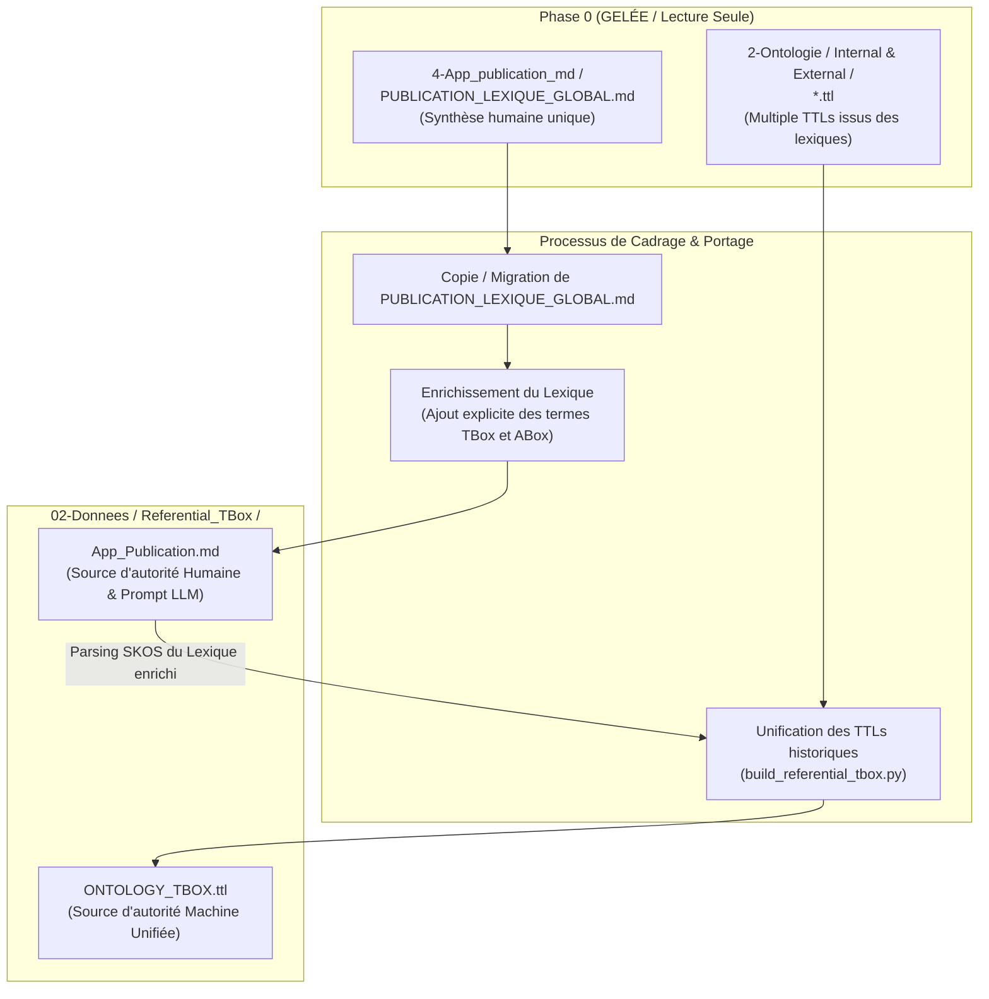

```mermaid

flowchart TD
    subgraph SOURCES["1. Sources d'Évolution TBox"]
        EXPERT["👤 Expert Métier / RSSI\n(Édition directe Markdown)"]
        AGENT["🤖 Agent Ingestion / NER\n(Détection d'anomalies sémantiques)"]
    end

    subgraph PROPOSAL["2. Boucle de Validation"]
        PROPOSALS["📝 TBOX_PROPOSALS.json\n(Suggestions de classes / propriétés)"]
        REVIEW["👤 Validation RSSI / Expert Métier"]
    end

    subgraph TBOX_LIVING["3. Référentiel Vivant (Referential_TBox)"]
        MD_MASTER["App_Publication.md\n(Vue Humaine & Diagrams Mermaid)"]
        BUILDER["build_referential_tbox.py\n(Script de Synthèse & Alignment)"]
        TTL_MASTER["ONTOLOGY_TBOX.ttl\n(TBox Machine Master)"]
    end

    subgraph CONSUMERS["4. Consommateurs Phase 1"]
        PROMPTS["Prompts System LLM (NER)"]
        ALIGNER["entity_aligner.py (RDFLib)"]
        NEO4J["Neo4j Schema & Constraints"]
    end

    EXPERT -->|Modifie| MD_MASTER
    AGENT -->|Détecte écarts TBox| PROPOSALS
    PROPOSALS --> REVIEW
    REVIEW -->|Approuvé| MD_MASTER

    MD_MASTER --> BUILDER
    BUILDER --> TTL_MASTER

    TTL_MASTER --> ALIGNER
    TTL_MASTER --> NEO4J
    MD_MASTER --> PROMPTS
```

```mermaid
flowchart TD
    subgraph PHASE0["Phase 0 (GELÉE / Lecture Seule)"]
        PUB_MD["4-App_publication_md /\nPUBLICATION_LEXIQUE_GLOBAL.md\n(Synthèse humaine unique)"]
        TTLS["2-Ontologie / Internal & External /\n*.ttl\n(Multiple TTLs issus des lexiques)"]
    end

    subgraph PORTAGE["Processus de Cadrage & Portage"]
        COPY["Copie / Migration de PUBLICATION_LEXIQUE_GLOBAL.md"]
        ENRICH["Enrichissement du Lexique\n(Ajout explicite des termes TBox et ABox)"]
        FUSION["Unification des TTLs historiques\n(build_referential_tbox.py)"]
    end

    subgraph TBOX_TARGET["02-Donnees / Referential_TBox /"]
        TARGET_MD["App_Publication.md\n(Source d'autorité Humaine & Prompt LLM)"]
        TARGET_TTL["ONTOLOGY_TBOX.ttl\n(Source d'autorité Machine Unifiée)"]
    end

    PUB_MD --> COPY
    COPY --> ENRICH
    ENRICH --> TARGET_MD

    TTLS --> FUSION
    TARGET_MD -->|Parsing SKOS du Lexique enrichi| FUSION
    FUSION --> TARGET_TTL

```