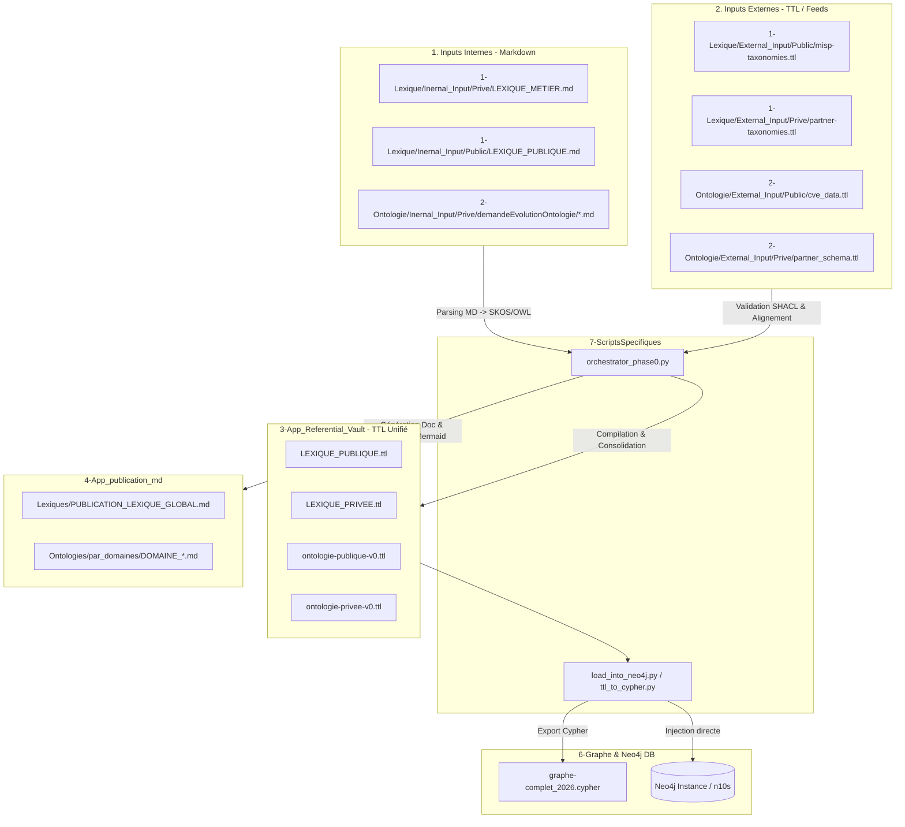

```
[ Sources Humaines / Markdown ]
  - 1-Lexique/Inernal_Input/Prive/LEXIQUE_METIER.md
  - 2-Ontologie/Inernal_Input/Prive/demandeEvolutionOntologie/TEMPLATE...
          │
          ▼  (Exécution de 7-ScriptsSpecifiques/orchestrator_phase0.py)
[ Compilation & Standardisation TTL ]
  - 3-App_Referential_Vault/LEXIQUE_PRIVEE.ttl
  - 3-App_Referential_Vault/ontologie-privee-v0.ttl
          │
          ├─────────────────────────────────────────┐
          ▼                                         ▼
[ Ingestion Neo4j ]                     [ Génération Restitution ]
  - 6-Graphe/graphe-complet_...cypher     - 4-App_publication_md/Lexiques/
                                          - 4-App_publication_md/Ontologies/par_domaines/
                                            
```
