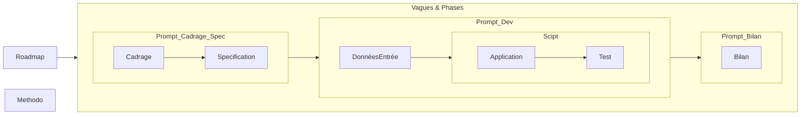

# DKG-Framework : Ingénierie de Graphes Sémantiques & IA Collaborateur

> **Un Framework Spec-Driven, AGILE et souverain pour concevoir des Graphes de Connaissances Dynamiques (DKG) sous la gouvernance stricte des standards W3C (OWL2, SKOS, SHACL).**  
> *Démonstrateur étalon appliqué au domaine de la Cybersécurité & du SOC.*

---

## 🚦 État d'Avancement Macro (Roadmap par Vagues)

| Vague | Titre & Horizon | Principes Pédagogiques (P#) | Statut |
| :---: | :--- | :--- | :---: |
| **V1** | **Socle Structurel & Cartographie** | (P1) Standards W3C, (P2) Confidentialité native TLP (Cas minimal PC) | 🟢 **PASSED** |
| **V2** | **Ingestion, NER & Alignement** | (P3) Superposition de graphes, (P4) Rapprochement sémantique (NER & Inférence) | 🟢 **PASSED** |
| **V3** | **Industrialisation & Multi-Contextes** | (P5) Architecture Agentique & Micro-agents distribués (Cas PME) | 🟡 **ACTIVE** |
| **V4** | **Désambiguïsation & Human-in-the-Loop** | (P6) Maintien de la cohérence face à la croissance : SKOS & Arbitrage Humain (MITM) | ⚪ **Planifié** |
| **V5** | **Agent Copilot & Fine-Tuning Continu** | (P7) Modèle local ré-entraîné (LoRA) sur DKG pour un Copilot explicable | ⚪ **Planifié** |
| **V6** | **Streaming Temps Réel & Reaction** | (P8) Démonstration de valeur sur boucle courte (SIEM/EDR / Analyse d'impact) | ⚪ **Planifié** |

👉 **[Pour plus de détails,  consulter la Roadmap complète](./00-Projet/Roadmap_Suivi-Avancement.md)**

---

## 1. Vision & Ambition du Framework

### Le Constat : Le Défi Humain & Informatique du "Sens Partagé"
Nous avons tous vécu ces quiproquos inépuisables entre équipes ou lors de retours d'expérience qui se concluent invariablement par : *"Il faut améliorer la communication"*. Les ambiguïtés lexicales, le jargon cloisonné et la perte de contexte coûtent une énergie considérable et dégradent la qualité opérationnelle.

Les technologies d'IA basées sur les **Graphes de Connaissances Dynamiques (DKG)** apportent enfin une solution pour partager le sens tout en respectant les niveaux de confidentialité. Mais il n'y a pas de magie : pour éviter les fausses équivalences et les hallucinations, ces technologies doivent rester **sous la gouvernance formelle des équipes**.

### L'Objectif : Un Framework Générique & Didactique
**Le projet DKG-Framework n'a pas pour fin ultime la cybersécurité.** Son but premier est d'offrir un **cadre d'ingénierie réutilisable** pour tout domaine exigeant (Santé, Finance, Aéronautique, Industrie) nécessitant :
* Une capitalisation continue des connaissances sans perte de cohérence.
* Un contrôle strict de la qualité des données (Closed World Assumption).
* Une interopérabilité native entre systèmes hétérogènes.

### Le Cas d'Usage Cyber : Un Démonstrateur Étalon Exigeant
Pour prouver la puissance du Framework, nous l'illustrons sur le domaine de la **Cybersécurité (SOC)** : un univers caractérisé par des silos de données majeurs (CTI externes, logs d'équipements, inventaires d'actifs, failles CVE). Si le Framework réussit à maintenir la cohérence d'un DKG Cyber, il peut être appliqué à n'importe quel domaine métier.

---

## 2. Methodologie & Co-Développement IA 

Ce projet est aussi l'occasion d'innover dans la methodologie. L'approche "Spec Driven" traditionnelle est appliquée, mais articulée avec :
- Le **développement assisté par LLM**,  et les pratiques pour éviter les hallucination et les dérives.
- les outils : **Obisian** , 
### 2.1. Methode Spec Driven


### 2.2. Assistance LLM
Gestion de l'attention du LLM
- Ouvrir une nouvelle discussion a chaque Phase voire entre deux étapes si les échanges ont été trop nombreux.
- Garantir un recallage de context avec : context_bundel.md généré a chaque fin de phase.
- Liste de Prompt et rappel de fichierq a transmettre 
		- Prompt master conservé par le LLM
		- Prompt d'étapes illustés ci dessus avec fichiers
		- et fichier config.py les variables chemins, nomfichiers, Namespace
- Fichiers a transmettre : Roamap, config.py
		  
#### A. Les 3 Prompts d'étape
1. **Prompt 1 / Cadrage & Spécifications (`[CONTEXT: CADRAGE-SPEC]`) :** Validation des pré-requis, écriture des `SPEC-*.md` et modélisation TBox (interdiction de coder).
2. **Prompt 2 / Dev, Data & Tests (`[CONTEXT: DEV-DATA]`) :** Génération du code Python, ingestion RDF Turtle (`.ttl`) et validation PyTest/SHACL sous contrainte SSOT (`config.py`).
3. **Prompt 3 / Rétrospective 5S & Clôture (`[CONTEXT: RETRO-5S]`) :** Replay vers le Master, auto-documentation Markdown (`DOC_*.md`) et mise à jour d'état.

#### B. Le Context Bundle (State Vector)
Afin de ne jamais dépasser la fenêtre d'attention du LLM et conserver un alignement parfait, le projet maintient un **Context Bundle maître** récapitulant l'état exact du graphe, les variables de configuration et l'historique des phases clôturées.

👉 **[Découvrir le Guide Méthodologique & les Prompts Intra-Phase](PROJECT_CONTEXT_PROMPT.md)**


### 2.3. Outils {Obsidian..}
	
Obsidian s’avère être un outil particulièrement bien adapté. Il est recommandé de l'utiliser avec ses plugins
- JupyMD
- mermaid view
- vscode Editor
- Templater
- DataView
  --> Permet d'automatiser les consolidation et générer des vues dynamiquement (dispo sous github a vérifier)


---

## 3. Les Grands Principes du Framework

### 3.1 - Principes pédagogique

* **Usage des Standards W3C (OWL2, SKOS, SHACL)** : Modélisation formelle pour éviter tout enfer propriétaire.
* **Gouvernance & Qualité Stricte (SHACL CWA)** : Contrôle systématique aux portes d'entrée du graphe (*Closed World Assumption*).
* **Gestion de la Confidentialité (TLP)** : Marquage natif de la sensibilité de la donnée (`TLP:CLEAR`, `TLP:AMBER`, `TLP:RED`).
* **Maîtrise de la Croissance & Désambiguïsation (Vague 4)** : Utilisation de taxonomies SKOS et de l'agent **Human-in-the-Loop (MITM)** pour arbitrer les concepts ambigus ($0.65 \le \text{Score} < 0.85$) et éviter l'explosion sémantique.
* **Souveraineté & Sobriété** : Capacité d'exécution complète sur PC standard (16Go RAM, sans GPU dédié).


### 3.2 - L'Articulations des Technologies : Qui fait quoi ? (Anti-Overlap)

Une idée reçue voudrait que la puissance des grands LLM permette de s'affranchir de la modélisation formelle ou du typage applicatif. **Notre approche prouve exactement l'inverse** : plus le LLM est puissant, plus ses garde-fous doivent être explicites pour garantir un résultat déterministe et souverain.

Chaque brique de l'architecture possède un rôle étanche et complémentaire :

```
┌─────────────────────────────────────────────────────────────────────────┐
│                           LLM / SLM LOCAL                               │
│  • Exploration textuelle, NER, formulation d'hypothèses, SPARQL RAG     │
└────────────────────────────────────┬────────────────────────────────────┘
                                     │ (Interface via Pydantic V2)
                                     ▼
┌─────────────────────────────────────────────────────────────────────────┐
│                      PYDANTIC V2 & config.py (SSOT)                     │
│  • Typage applicatif strict, Immutabilité, Adresses de fichiers (Path)  │
└────────────────────────────────────┬────────────────────────────────────┘
                                     │ (Injection & Validation)
                                     ▼
┌─────────────────────────────────────────────────────────────────────────┐
│                     STANDARDS W3C (OWL2, SKOS, SHACL)                   │
│  • Garde-fou formel, Raisonnement déterministe, Closed World (CWA)      │
└─────────────────────────────────────────────────────────────────────────┘
```

#### 1. `config.py` & Pydantic V2 : Le Socle Applicatif (SSOT Code)

- **Son rôle :** Il constitue la Source Unique de Vérité (_Single Source of Truth_) pour l'environnement d'exécution Python.
    
- **Sa valeur ajoutée :** Grâce à `pydantic-settings` et à des modèles immutables (`frozen=True`), il valide les chemins de fichiers, les variables d'environnement, les seuils de confiance (ex: $0.65 \le \text{Score} < 0.85$) et les espaces de noms (_Namespaces_) **avant même d'interroger la mémoire RDF**. Il interdit toute chaîne de caractères "en dur" dans le code.
    

#### 2. Standards W3C (OWL2, SKOS, SHACL) : Le Garde-Fou Sémantique (SSOT Métier)

- **Son rôle :** Garantir la cohérence logique et l'intégrité de la base de connaissances.
    
- **Sa valeur ajoutée :** Là où le LLM raisonne par probabilités, OWL2 déduit par logique formelle (ex: relations inverses) et SHACL valide sous contrainte _Closed World Assumption_ (CWA). Une assertion proposée par l'IA est **rejetée sans sommation par SHACL** si elle ne respecte pas le schéma du domaine.
    

#### 3. Le LLM Collaborateur : Le Moteur d'Inférence & d'Extraction

- **Son rôle :** Capturer l'ambiguïté du monde réel (texte brut CTI, logs non structurés, langage naturel).
    
- **Sa valeur ajoutée :** Il ne cherche pas à remplacer l'ontologie ni le code Python ; il sert de "pont" capable de traduire la complexité textuelle vers les structures Pydantic, qui sont ensuite validées par SHACL avant d'intégrer le Graphe Master.
    

> **En résumé :** Le LLM propose, Pydantic structure, SHACL/OWL dispose. Aucune technologie ne chevauche le périmètre de l'autre (_zero overlap_).
---


## 4. Structure du Référentiel

```
DKG-CYBERSEC/
├── 00-Projet/                          # Gouvernance, checklists, Roadmap et livrables Phase_Content.md
├── 01-Principes_Spécification/         # Spécifications fonctionnelles et techniques (SPEC-XX)
├── 02-Donnees/                         # Artefacts RDF Turtle (.ttl) et auto-documentation miroir (.md)
│   ├── Snapshots_Phases/               # Historique figé par Phase
│   └── Master_Transversal/             # Graphe unifié consolidé (TBox, ABox RED/CLEAR)
└── 03-Application/                     # Outillage Python, agents IA, API Gateway et suites PyTest
```
👉 **[Pour plus de détails,  consulter l'index fichiers _( /!\ certaines vues peuvent requerir l'autorisation javascript et/ou obsidian)_](./00-Projet/Index_fichiers.md)**

## 5. Comment utiliser
- Cloner le repository
- Mettre en place un environnement virtuel avec le fichier requirement.txt
- Mettre en place Obsidian et ses pluggins
- Gardez les /02-Donnes/Input_Phases/\*.* 
- Déplacez les /02-Donnees/Snapshots_Pases/\*.*  et 02-Donnees/Master_Transversal/\*.*
- Relancer Phase par phase les script /03-Application/PhaseX/
- Observez la re-génération des données déplacées ( ci-dessus)
- Lancez les tests de la phase /03-Application/Test/test_phaseX...
- Observez l'articulation des données entre les différent répertoires .ttl représentant les graphs avec leur étiquelle de confidentialité (TLP  _Turn Light Protocol_) avec les version md ou directement sur le ttl.
  
Avec les deux premières vagues une compréhension des principes de base se développera  et j'éspère la convction de leur puissance. l'IA n'a rien de magique. Mais ici la combinaison des modeles simple de NER ( Named Entity Recognition) et la superposition des Graph on perçois un mécanisme sur lequel on peut se reposer.  


## 6. Réutilisation du Framework sur Votre Propre Domaine

Vous souhaitez adapter la méthode DKG-Framework à un autre cas d'usage (Santé, Finance, Logistique) ?

1. **Adoptez la démarche Spec-Driven :** Définissez vos exigences formelles dans `01-Principes_Spécification/`.
    
2. **Utilisez le Triptyque de Prompts :** Guidez votre LLM collaborateur via les modèles du dossier [`PROJECT_CONTEXT_PROMPT.md`](https://www.google.com/search?q=PROJECT_CONTEXT_PROMPT.md).
    
3. **Instanciez la TBox & SHACL :** Déployez votre propre vocabulaire métier tout en réutilisant nos scripts de validation et de gestion des environnements.
