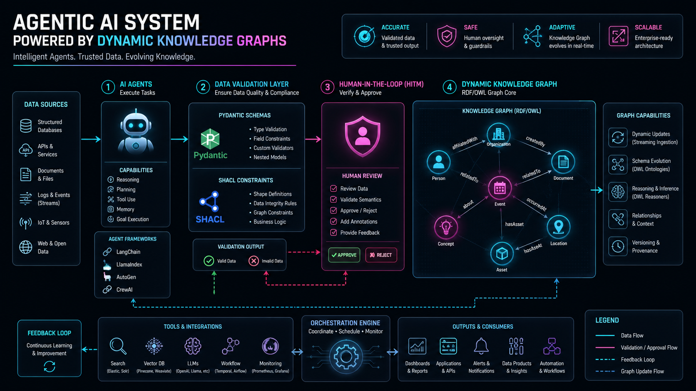
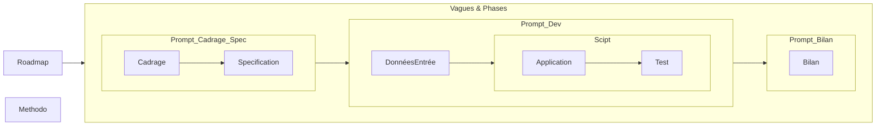

# DKG-CyberSec : Framework de Solution IA Agentique Basé sur les Graphes de Connaissance

Un Framework souverain pour concevoir des Graphes de Connaissances Dynamiques (DKG) sous la gouvernance stricte des standards W3C (OWL2, SKOS, SHACL), doté d'une sécurité et d'une isolation natives (Matrice TLP), et résolument **Green-by-Design & Local-First**.  
Le cas d'usage étalon didactique utilisé pour les démonstrateurs est un Security Operation Center (SOC) résidentiel et d'entreprise.
....
---

## Le Constat : Le Défi Humain & Informatique du "Sens Partagé"
Les ambiguïtés lexicales, le jargon cloisonné et la perte de contexte coûtent une énergie considérable et dégradent la qualité opérationnelle des équipes de sécurité.  
Les technologies d'IA basées sur les Graphes de Connaissances Dynamiques (DKG) apportent une solution pour partager le sens tout en respectant les niveaux de confidentialité. Cependant, pour éviter les fausses équivalences et les hallucinations, ces technologies doivent impérativement reposer sur une **Source Unique de Vérité (SSOT)** et être gouvernées par des standards formels (Closed World Assumption).

## La Vision & Les Piliers Techniques
1. **Adhérence W3C Stricte (100% OWL2 / SKOS / SHACL) :** Traçabilité formelle, réversibilité et validation logique formelle.
2. **Sécurité & Isolation Native (TLP Matrix) :** Ségrégation absolue des flux (CLEAR, AMBER, RED) garantie par architecture et filtrage par passerelle[cite: 1, 2].
3. **Green-by-Design & Local-First :** Calibré pour tourner en local et en mode Air-Gapped (poste standard de 16 Go de RAM, sans GPU dédié), minimisant l'empreinte carbone[cite: 1, 2].
4. **L'Arbitrage de Rupture (W3C vs Moteurs Propriétaires) :** Évaluer empiriquement les limites de charge du modèle standard avant d'envisager, si nécessaire, une passerelle vers des moteurs de graphes non-standards (type Neo4j), tout en documentant formellement la perte sémantique associée[cite: 1, 2].

|  |  |  |
| -------------------------------------------------------------------------------- | ----------------------------------------------------------------- | ----------------------------------------------------------------------------------------- |



---
## 🚦 État d'Avancement Macro (Roadmap par Vagues)

| Vague | Titre & Horizon | Sens & Principes Pédagogiques | Statut |
| :---: | :--- | :--- | :---: |
| **V1** | Socle Structurel & Cartographie Interne | (P1) Standards W3C (OWL2, SKOS, SHACL)<br>(P2) Confidentialité native (TLP:AMBER / TLP:RED).<br>Cas d'usage : PC individuel. | 🟢 PASSED |
| **V2** | Ingestion CTI, NER & Alignement Primitif | Superposition de graphes<br>Rapprochement sémantique et NER local.<br>Cas d'usage : CTI externe (NVD, CISA KEV) & texte brut. | 🟢 PASSED |
| **V3** | Industrialisation, Micro-Agents & Gateway | Structure IA Agentique et API Gateway sécurisée (Cross-TLP).<br>Cas d'usage : Micro-entreprise, passerelle SPARQL immutable. | 🟢 PASSED |
| **V4** | Gouvernance Agentique, MCP & Conformité | **Intégration du protocole MCP**, architecture multi-agents, découpage incrémental, finesse SKOS et conformité RGPD/NIS2. | 🟡 ACTIVE |
| **V5** | GraphRAG Hybride & Multi-Engine Neo4j | Assistant NL-to-SPARQL avancé, pont vers base de graphe propriétaire (n10s) et production des abaques de comparaison W3C/Neo4j. | ⚪ Planifié |
| **V6** | SOC Distribué, Émulation Edge & SOAR | Calcul distribué (Map-Reduce SPARQL), génération de playbooks de remédiation et mesure de la sobriété. | ⚪ Planifié |

👉 **[Pour plus de détails sur la roadmap, consulter la Roadmap complète](Roadmap.md)**

|  | Pour exécuter les tests localement : `cd 03-Application && pytest` |
| ----------------------------------------------------------------------------------------- | ------------------------------------------------------------------------- |

---

## 2. Méthodologie & Co-Développement IA

Ce projet est aussi l'occasion d'innover dans la méthodologie. L'approche "Spec Driven" traditionnelle est appliquée, mais articulée avec :
- Le **développement assisté par LLM**, et les pratiques pour éviter les hallucinations et les dérives.
- Les outils : **Obsidian**

### 2.1. Méthode Spec Driven

```mermaid
	graph LR
		R[Roadmap]
		M[Methodo]
		subgraph VP[Vagues & Phases]
			direction LR
		    subgraph P1[Prompt_Cadrage_Spec]
			    direction LR
			    C[Cadrage] --> Sp[Specification] 
		    end
     		subgraph P2[Prompt_Dev]
	     		direction LR
		    	D[DonnéesEntrée]
			    subgraph Sc[Scipt]
				    direction LR
				    A[Application] --> T[Test]
			    end
			    D --> Sc
		    end
		    subgraph P3[Prompt_Bilan]
			    direction LR
			    B[Bilan]
			end
		    P1 --> P2 --> P3
		end
		R --> VP
```

### 2.2. Assistance LLM & Gestion de l'attention

- Ouvrir une nouvelle discussion à chaque Phase voire entre deux étapes si les échanges ont été trop nombreux.
    
- Garantir un recalage de contexte avec un certain nombre de données compactes :
    
    - Roadmap vision globale
        
    - Spécification et Exigence en format TSV
        
    - Partage d'un fichier rassemblant les variables, chemins, noms de fichiers et Namespaces (`03-Application/config.py`)
        

#### A. Les 3 Prompts d'étape

1. **Prompt 1 / Cadrage & Spécifications (`[CONTEXT: CADRAGE-SPEC]`) :** Validation des pré-requis, écriture des `SPEC-*.md` et modélisation TBox (interdiction de coder).
    
2. **Prompt 2 / Dev, Data & Tests (`[CONTEXT: DEV-DATA]`) :** Génération du code Python, ingestion RDF Turtle (`.ttl`) et validation PyTest/SHACL sous contrainte SSOT (`config.py`).
    
3. **Prompt 3 / Rétrospective 5S & Clôture (`[CONTEXT: RETRO-5S]`) :** Replay vers le Master, auto-documentation Markdown (`DOC_*.md`) et mise à jour d'état.
    

### 2.3. Outils (Obsidian & Plugins)

Obsidian s’avère être un outil particulièrement bien adapté. Il est recommandé de l'utiliser avec ses plugins :

- JupyMD
    
- Mermaid view
    
- VSCode Editor
    
- Templater
    
- DataView
    

## 3. Les Grands Principes du Framework

### 3.1 - Principes Pédagogiques

- **Usage des Standards W3C (OWL2, SKOS, SHACL)** : Modélisation formelle pour éviter tout enfer propriétaire[cite: 1, 2].
    
- **Gouvernance & Qualité Stricte (SHACL CWA)** : Contrôle systématique aux portes d'entrée du graphe (_Closed World Assumption_)[cite: 1, 2].
    
- **Gestion de la Confidentialité (TLP)** : Marquage natif de la sensibilité de la donnée (`TLP:CLEAR`, `TLP:AMBER`, `TLP:RED`)[cite: 1, 2].
    
- **Standardisation Agentique (MCP)** : Utilisation du protocole MCP dès la Vague 4 pour exposer les ressources du graphe et les outils de validation de manière découplée.
    
- **Souveraineté & Sobriété** : Capacité d'exécution complète sur PC standard (16 Go RAM, sans GPU dédié)[cite: 1, 2].
    

### 3.2 - L'Articulation des Technologies : Qui fait quoi ? (Anti-Overlap)

Une idée reçue voudrait que la puissance des grands LLM permette de s'affranchir de la modélisation formelle ou du typage applicatif. **Notre approche prouve exactement l'inverse** : plus le LLM est puissant, plus ses garde-fous doivent être explicites pour garantir un résultat déterministe et souverain.

Chaque brique de l'architecture possède un rôle étanche et complémentaire :

```
┌─────────────────────────────────────────────────────────────────────────┐
│                           LLM / SLM LOCAL                               │
│  • Exploration textuelle, NER, formulation d'hypothèses, SPARQL RAG     │
└────────────────────────────────────┬────────────────────────────────────┘
                                     │ (Interface via MCP & Pydantic V2)
                                     ▼
┌─────────────────────────────────────────────────────────────────────────┐
│                      PYDANTIC V2 & config.py (SSOT)                     │
│  • Typage applicatif strict, Immutabilité, Adresses de fichiers (Path)  │
└────────────────────────────────────┬────────────────────────────────────┘
                                     │ (Injection & Validation)
                                     ▼
┌─────────────────────────────────────────────────────────────────────────┐
│                     STANDARDS W3C (OWL2, SKOS, SHACL)                   │
│  • Garde-fou formel, Raisonnement déterministe, Closed World (CWA)      │
└─────────────────────────────────────────────────────────────────────────┘
```

1. **`config.py` & Pydantic V2 (SSOT Code) :** Valide les chemins de fichiers, les variables d'environnement et les seuils avant d'interroger la mémoire RDF. Interdit toute chaîne de caractères en dur.
    
2. **Standards W3C (OWL2, SKOS, SHACL) (SSOT Métier) :** Garantit la cohérence logique. Une assertion proposée par l'IA est **rejetée sans sommation par SHACL** si elle ne respecte pas le schéma.
    
3. **Le LLM Collaborateur :** Capture l'ambiguïté du monde réel (texte brut CTI, logs non structurés) et traduit la complexité textuelle vers des structures validées par SHACL.
    

## 4. Structure du Référentiel

```
DKG-CYBERSEC/
├── 00-Projet/                          # Gouvernance, checklists, Roadmap et livrables Phase_Content.md
├── 01-Principes_Spécification/         # Spécifications fonctionnelles et techniques (SPEC-XX)
├── 02-Donnees/                         # Artefacts RDF Turtle (.ttl) et auto-documentation miroir (.md)
│   ├── Snapshots_Phases/               # Historique figé par Phase
│   └── Master_Transversal/             # Graphe unifié consolidé (TBox, ABox RED/CLEAR)
└── 03-Application/                     # Outillage Python, agents IA, API Gateway et suites PyTest
```

👉 **[Pour plus de détails, consulter l'index fichiers _( certaines vues peuvent requérir l'autorisation JavaScript et/ou Obsidian)_](https://www.google.com/search?q=./00-Projet/Index_fichiers.md&utm_source=gemini)**

## 5. Comment Utiliser

1. Cloner le repository GitHub.
    
2. Mettre en place un environnement virtuel avec le fichier `requirements.txt`.
    
3. Configurer Obsidian et ses plugins recommandés.
    
4. Garder les sources dans `02-Donnees/Input_Phases/`.
    
5. Exécuter phase par phase les scripts situés dans `03-Application/PhaseX/` et observer la régénération des snapshots et du Master Transversal.
    
6. Lancer les tests correspondants via `pytest` dans `03-Application/Test/`.
    

## 6. Réutilisation du Framework sur Votre Propre Domaine

Vous souhaitez adapter la méthode DKG-Framework à un autre cas d'usage (Santé, Finance, Logistique) ?

1. **Adoptez la démarche _Spec-Driven_ :** Adaptez les exigences formelles dans `01-Principes_Spécification/USECASE_METIER/`.
    
2. **Adaptez les données d'entrées :** Placez vos données dans `02-Donnees/Input_Phases/`.
    
3. **Relancez les scripts :** Exécutez les scripts de chaque phase pour reconstruire TBox et ABox.
    
4. **Interagissez avec le LLM :** Respectez les consignes de partage de données et de génération de contextes de fin de phase.
